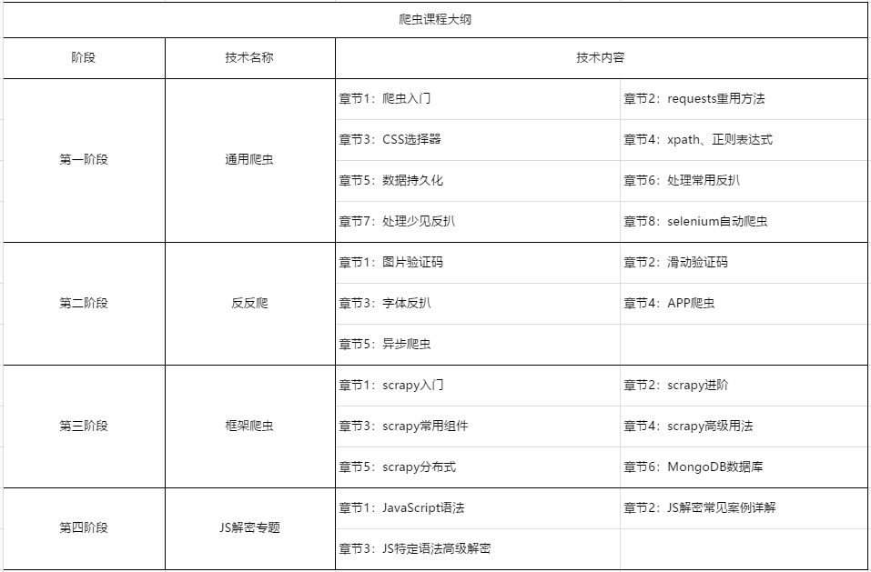

# 入门导学

## 开班注意

### 上课形式

平台 ：腾讯课堂

下载安装，手机电脑版都有


### 上课时间

周一、周二、周四、周五、周六：20:00-22:00

如果作业不会写的提前半小时


### 解答时间

每天：13:00-23:00

方式：微信、QQ、远程协助

> 提前安装好：teamviewer


### 爬虫课内容




### 学习的方法：

+ 没有基础，需要很多记忆的东西，做笔记
+ 多敲多练、多看代码
+ 写作业、多找老师解答
+ 在学习过程中，尽量不去学习课程之外的东西 
+ 出现bug，调试时间不超15分钟。（超出后寻求帮助）
+ 解答不及时时，bug文件保留，重新开始重写案例。
+ 先按照案例进行，敲过一遍成功案例之后，才可以自行改动。
+ **在学习中去记忆，而不是在记忆中学习** 


### 本课程优缺点：

**优点**

+ 内容丰富
+ 案例多、作业多

**缺点**

+ 填鸭式教育（超长解答服务与重修机制）


### 常用工具：

**开发环境：**

**Python版本：** Python 3.6.5 | Anaconda, Inc.

**编辑器：** pycharm社区版

**代码编辑器：** pycharm 

- typora（makedown）
- notepad++
- teamviewer


### 注意事项：

对于零基础同学，课程还是有一点难度的，遇到了问题记得找老师。

我们是直播课，不是录播课，多互动。千万别把直播当成录播来学习。


### 解释器

#### python

这个`解释器` 是用C语言开发的，也叫 `CPython` 。 在命令行下运行 `python` 就是启动 `CPython解释器`。 `CPython` 是使用最广的 `Python解释器`。 教程的所有代码也都在 `CPython` 下执行。

> 除了 `cpython` 解释器之外，还有 `Jpython` , `IronPython` 以及 `PyPy` 。

#### `ipython` 

`IPython` 是基于 `CPython` 之上的一个交互式解释器，也就是说，`IPython` 只是在交互方式上有所增强，但是执行Python代码的功能和 `CPython` 是完全一样的。

`IPython` 是一个交互式计算系统。主要包含三个组件：增加的交互式 “Python shell”，解耦的双过程通信模型，交互式并行计算的架构。支持变量自动补全。

`CPython` 用 `>>>` 作为提示符，而 `IPython` 用 `In [序号]:` 作为提示符。

#### anaconda

Anaconda指的是一个开源的 `Python` 发行版本，其包含了`conda`、`Python` 等180多个科学包及其依赖项。因为包含了大量的科学包，Anaconda 的下载文件比较大（约 531 MB），如果只需要某些包，或者需要节省带宽或存储空间，也可以使用 `Miniconda` 这个较小的发行版（仅包含 `conda` 和 `Python`）。


### 集成开发环境

> 集成开发环境（`IDE`，Integrated Development Environment ）

#### `pychram` 

`PyCharm` 是一种 `Python IDE` ，带有一整套可以帮助用户在使用 `Python` 语言开发时提高其效率的工具，比如调试、语法高亮、Project管理、代码跳转、智能提示、自动完成、单元测试、版本控制。此外，该 `IDE` 提供了一些高级功能，以用于支持 `Django` 框架下的专业 `Web` 开发。

#### `VS code` 

全程是 `Visual Studio Code` ， (简称 `VS Code` ) 是一款免费开源的现代化轻量级代码编辑器，支持语法高亮、智能代码补全、自定义热键、括号匹配、代码片段、代码对比等特性，并针对网页开发和云端应用开发做了优化。软件跨平台支持 Win、Mac 以及 Linux，运行流畅，可谓是微软的良心之作……


#### 我的开发环境：

解释器：

Anaconda（`Python3.6.5`)

编辑器：

 `Pycharm 社区版` 

交互式命令行：

 `Ipython` 

浏览器：

Chrome + `谷歌上网助手` 


### Pycharm的使用

### pip的使用

- 安装软件包：`pip install 包名` 

注：这里的包名，也可以是已经下载好的whl文件或tar.gz压缩包文件路径，或者包所在的URL地址。

- 升级pip自身：`pip install --upgrade pip` 
- 查看已经通过pip安装的包：`pip list` 
- 显示当前已经通过pip安装的包及版本号：`pip freeze`，显示结果示例：

- 安装本地的安装包：`pip install 目录|文件名` 


#### pip镜像源的设置与使用

pip国内的一些镜像

  阿里云 http://mirrors.aliyun.com/pypi/simple/ 
  中国科技大学 https://pypi.mirrors.ustc.edu.cn/simple/ 
  豆瓣(douban) http://pypi.douban.com/simple/ 
  清华大学 https://pypi.tuna.tsinghua.edu.cn/simple/ 
  中国科学技术大学 http://pypi.mirrors.ustc.edu.cn/simple/

注：使用国内的镜像源，安装各种包速度会快一些。

**临时使用：**

```
pip install 包名 -i 镜像url
```

#### **永久修改：** 

pip 配置文件：

- Unix、Mac OS的pip配置文件位于：`$HOME/.pip/pip.conf`
- Windows的pip配置文件位于：`%HOME%\pip\pip.ini`
  注：Windows下%HOME%路径一般为：`C:\Users\<UserName>\`

往 pip 目录下创建一个 `pip.ini` 配置文件写入如下内容（如果没有配置文件则在相应路径新建一个），这里以豆瓣的镜像为例：

```
[global]
trusted-host=pypi.douban.com
timeout=6000
index-url=http://pypi.douban.com/simple
```

 **一个经验** ：如果在指定国内的镜像源后，安装某些库速度还是比较慢，那么可以直接在浏览器打开镜像源网站地址（比如：[http://pypi.douban.com/simple](https://link.jianshu.com?t=http%3A%2F%2Fpypi.douban.com%2Fsimple)），在浏览器中直接搜索并下载所需的库，然后使用命令`pip install <文件名>` 进行安装。

> win+R 打开用户目录%HOMEPATH%，在此目录下创建 pip 文件夹，在 pip 目录下创建 pip.ini 文件, 内容如下
>
> ```
> [global]
> timeout = 6000
> index-url = http://pypi.douban.com/simple
> trusted-host = pypi.douban.com
> ```


# 提问的智慧

## 在提问之前

在你准备要提出问题前，请先做到以下事情：

1. 尝试自己检查或试验以找到答案。
2. 尝试上网搜索以找到答案。
3. ~~尝试阅读常见问题文件（FAQ）以找到答案。~~
4. ~~尝试阅读手册以找到答案。~~


如果你“不假思索”地提问，很大概率你得不到你想要的答案；即使你这次侥幸得到了正确解答，你肯定还会有更多的问题，而这些问题会越问越多。


## 当你提问时

### 描述目标而不是过程

如果你想弄清楚如何做某事（而不是报告一个 Bug），在开头就描述你的目标，然后才陈述重现你所卡住的特定步骤。

你别笑，我真遇到过这样报告问题的：“我发现了个 bug，你的软件不能做 XXX。”我回复：“这不是 bug，是个 feature。”并关闭。

软件所有的功能通常都在界面或者参数上提供出来，文档上也会有相应描述。如果某个功能你找不到入口，只有两种情况：

1. 这个功能是个彩蛋
2. 没这功能


### 去掉无意义的提问句

避免用无意义的话结束提问，例如 `有人能帮我吗？` 或者 `这有答案吗？` 。

首先：如果你对问题的描述不是很好，这样问更是画蛇添足。

其次：由于这样问是画蛇添足，黑客们会很厌烦你 —— 而且通常会用逻辑上正确，但毫无意义的回答来表示他们的蔑视， 例如：`没错，有人能帮你`或者`不，没答案`。

一般来说，避免用 `是或否`、`对或错`、`有或没有`类型的问句，除非你想得到[是或否类型的回答](http://homepage.ntlworld.com./jonathan.deboynepollard/FGA/questions-with-yes-or-no-answers.html)。


### 清楚明确的表达你的问题以及需求

漫无边际的提问是近乎无休无止的时间黑洞。最有可能给你有用答案的人通常也正是最忙的人（他们忙是因为要亲自完成大部分工作）。这样的人对无节制的时间黑洞相当厌恶，所以他们也倾向于厌恶那些漫无边际的提问。

如果你明确表述需要回答者做什么（如提供指点、发送一段代码、检查你的补丁、或是其他等等），就最有可能得到有用的答案。因为这会定出一个时间和精力的上限，便于回答者能集中精力来帮你。这么做很棒。

要理解专家们所处的世界，请把专业技能想像为充裕的资源，而回复的时间则是稀缺的资源。你要求他们奉献的时间越少，你越有可能从真正专业而且很忙的专家那里得到解答。

所以，界定一下你的问题，使专家花在辨识你的问题和回答所需要付出的时间减到最少，这技巧对你有用答案相当有帮助 —— 但这技巧通常和简化问题有所区别。因此，问`我想更好的理解 X，可否指点一下哪有好一点说明？`通常比问`你能解释一下 X 吗？`更好。如果你的代码不能运作，通常请别人看看哪里有问题，比要求别人替你改正要明智得多。


### 使用有意义且描述明确的标题

再多的跪求、在线等、标点符号、Emoji 或者特殊符号也解决不了你碰到的问题，反而会被黑客们“条件反射式地忽略”，简明扼要的标题是一个好问题的开始。

> 一个好标题范例是目标 —— 差异式的描述，许多技术支持组织就是这样做的。在目标部分指出是哪一个或哪一组东西有问题，在差异部分则描述与期望的行为不一致的地方。
>
> `X.org` 6.8.1 的鼠标光标，在某牌显卡 MV1005 芯片组环境下 - 会变形。

另外，这一小节对在回复中提出新问题也给出了建议：无论是邮件列表还是网页论坛，尽量不要在回复中提出新问题，新问题就新发邮件或者新开帖子。


### 精确地描述问题并言之有物

- 仔细、清楚地描述你的问题或 Bug 的症状。
- 描述问题发生的环境（机器配置、操作系统、应用程序、以及相关的信息），提供经销商的发行版和版本号
- 描述在提问前你是怎样去研究和理解这个问题的。
- 描述在提问前为确定问题而采取的诊断步骤。
- 描述最近做过什么可能相关的硬件或软件变更。
- 尽可能的提供一个可以`重现这个问题的可控环境`的方法。

尽量去揣测一个黑客会怎样反问你，在你提问之前预先将黑客们可能遇到的问题回答一遍。

以上几点中，当你报告的是你认为可能在代码中的问题时，给黑客一个可以重现你的问题的环境尤其重要。当你这么做时，你得到有效的回答的机会和速度都会大大的提升。


## 重点

1. **不要直接把错误直接发给我，单单一个错误我看不出错误。请把错误信息截图发给我。** 
2. **对于思路混乱的问题，请先把思路理清楚之后再向我描述（别把我绕进去了）** 
3. **与代码有关的问题，请直接把代码文件打包发给我（尤其是有很多文件时）** 
4. **不代写代码，只解答问题** 


