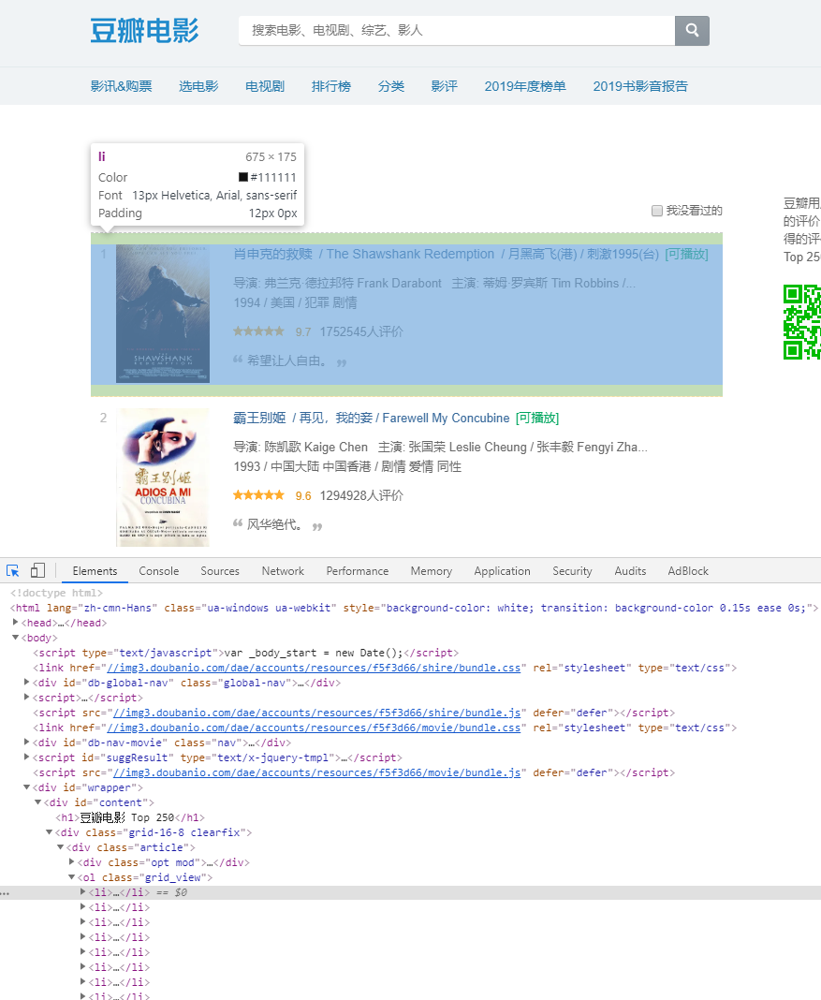
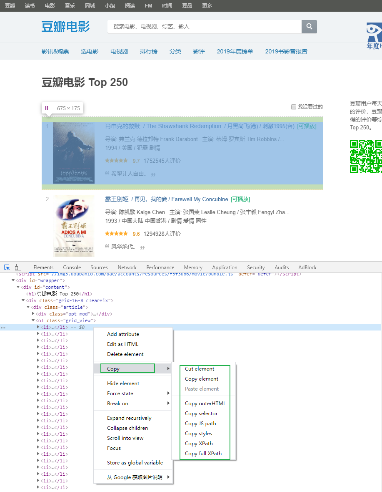
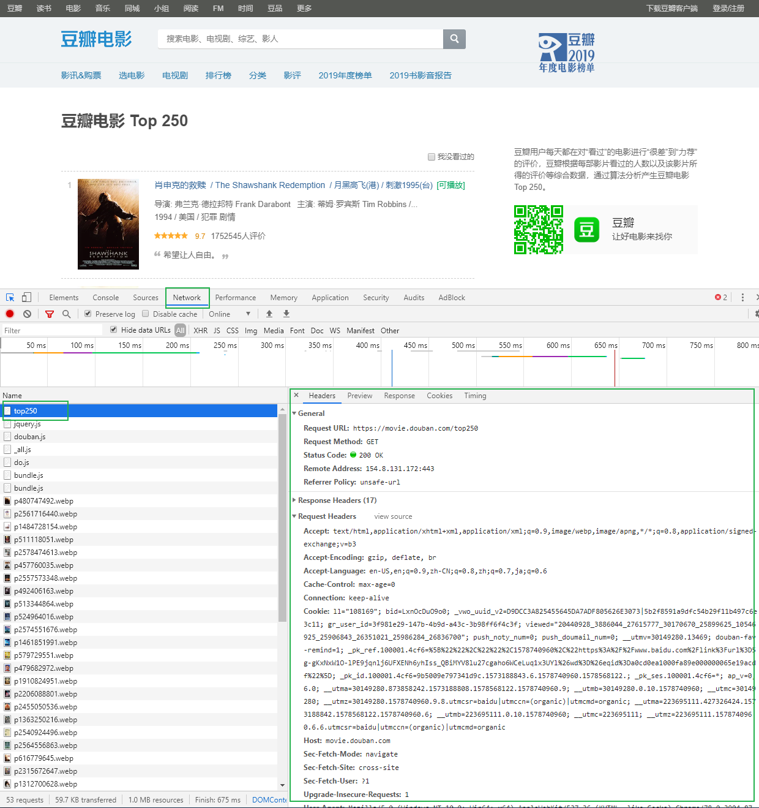
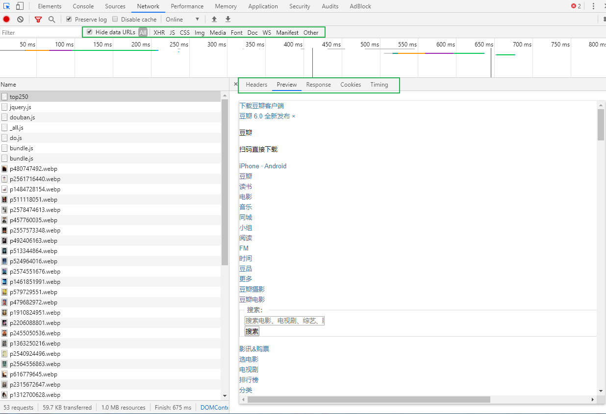
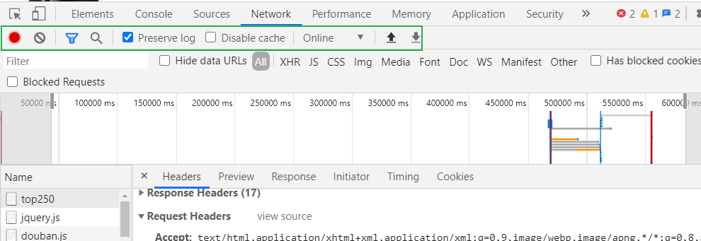

# chrome 开发者工具

当我们爬取不同的网站是，每个网站页面的实现方式各不相同，我们需要对每个网站都进行分析。那是否有一些通用的分析方法？我分享下自己爬取分析的“套路”。在某个网站上，分析页面以及抓取数据，我用得最多的工具是 **Chrome 开发者工具**。

Chrome 开发者工具是一套内置于 Google Chrome 中的 Web 开发和调试工具，可用来对网站进行迭代、调试和分析。因为国内很多浏览器内核都是基于 Chrome 内核，所以国产浏览器也带有这个功能。例如：UC 浏览器、QQ 浏览器、360 浏览器等。

接下来，我们来看看 Chrome 开发者工具一些比较牛逼的功能。

## 元素面板

通过元素（Element）面板，我们能查看到想抓取页面渲染内容所在的标签、使用什么 CSS 属性（例如：class="middle"）等内容。例如我想要抓取我知乎主页中的动态标题，在网页页面所在处上右击鼠标，选择“**检查**”，可进入 Chrome 开发者工具的**元素面板**。

通过这种方法，我们能快速定位出页面某个 DOM 节点，然后可以提取出相关的解析语句。鼠标移动到节点，然后右击鼠标，选择 “Copy”，能快速复制出 Xpath 、CSS elector 等内容解析库的解析语句。

##  网络面板

网络（Network）面板记录页面上每个网络操作的相关信息，包括详细的耗时数据、HTTP 请求与响应标头和 Cookie，等等。这就是我们通常说的抓包。

其中的 **Filters** 窗格，我经常使用其来过滤出一些 HTTP 请求，例如过滤出使用 Ajax 发起的异步请求、图片、视频等。

最大的窗格叫 **Requests Table**，此表格会列出了检索的每一个 HTTP 请求。默认情况下，此表格按时间顺序排序，最早的资源在顶部。点击资源的名称可以显示更多信息。

### Requests Table参数：

**all**：所有请求数据（图片、视频、音频、js代码、css代码）

**XHR**：XMLHttpRequest 的缩写，是ajax技术的核心，动态加载完成经常分析的一个内容

**CSS**: css样式文件

**JS**：JavaScript文件，js解密是常分析的一个页面

**Img**： Images 图片文件

**Font**： 字体文件（字体反扒）

**DOC** ： Document，文档内容

**WS**: WebSocket，web端的socket数据通信，一般用于一些实时更新的数据

### Requests详情：

#### 请求头

**Headers** 是显示 HTTP 请求的 Headers，我们通过这个能看到请求的方式，以及携带的请求参数等。

+ General

  **Request url** ：实际请求的网址

  **Request Method**： 请求方法

  **Status Code**： 状态码，成功时为 200

+ Response Headers 

  服务器返回时设置的一些数据，例如服务器更新的cookie数据最新是在这里出现修改

+ Requests Headers

  请求体，请求不到数据的原因一般出在这里。反扒也是反扒请求体里面的数据

  **Accept**：服务器接收的数据格式（一般忽略）

  **Accept-Encoding:** 服务器接收的编码（一般忽略）

  **Accept-Language:** 服务器接收的语言（一般忽略）

  **Connection:** 保持连接（一般忽略）

  **Cookies：** cookies信息，是身份信息，爬取VIP资源是需要携带身份信息

  **Host:** 请求的主机地址

  **User-Agent:** 用户身份代理，服务器根据这个判断用户的大概信息

  **Sec-xxx-xxx:** 其他信息，可能没用，可能是反扒。具体情况具体分析

#### 预览

**Preview** 是请求结果的预览。一般用来查看请求到的图片，对于抓取图片网站比较给力。

#### 响应体

**Response** 是请求返回的结果。一般的内容是整个网站的源代码。如果该请求是异步请求，返回的结果内容一般是 Json 文本数据。

此数据与浏览器展示的网页可能不一致，因为浏览器是动态加载的

## 工具栏

### Clear

清空所有数据，每一次重新分析是都需要清空之前的数据

### Search

搜索框，只要在 **ALL** 里面出现的过的内容，就可以被直接搜索到。常用与数据检索与 JS 解密

### Preserve log

保留日志。当分析在多个页面跳转的内容时，一定要勾上，不然当页面发生新的跳转是，历史数据全部都会被清空。

#### Disable cache

清空 JavaScript、css 文件的缓存，获取最新的。

保留日志，做爬虫是一定需要勾上

### HTTP 传输

https://mp.weixin.qq.com/s/aSwXVrz47lAvQ4k0o4VcZg

