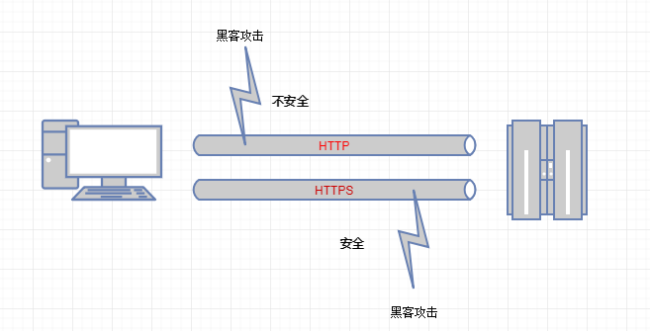
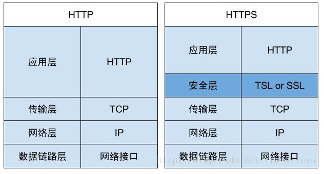
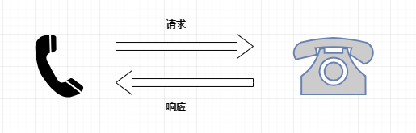
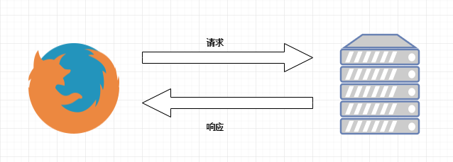
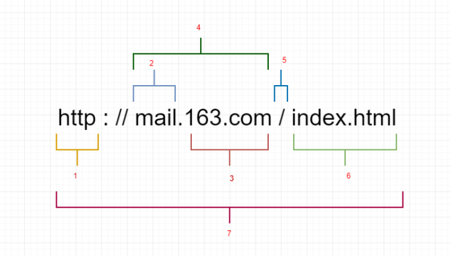
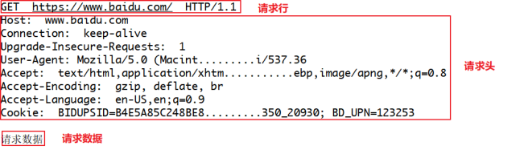

# 1. Python爬虫介绍

> 爬虫课程特点

课程不会教如何去套代码

主要是教你思路，让你自己学会如何去写

写作业不是目的，目的是熟悉代码以及学会代码的思路。

因为学员掌握的程度不一样，所以会从最简答的内容开始讲解，慢慢过渡的难的。

爬虫的实战性要求很强。爬虫经常需要爬取商业网站或政府网站的内容，而这些网站随时可能进行更新，另外网络原因和网站反爬虫机制也会对爬虫代码演示造成干扰。每次上课之前会先测试备课代码，但是如果网站更新发生在授课期间或者反爬虫机制触发，会尽量在短时间内尝试解决。如果问题很棘手，那么课堂上，请不要过度纠结这个具体问题。

## 1.1 爬虫的用处

**网络爬虫**：按照一定的规则，自动地抓取互联网信息的程序。

首先请问：都说现在是"大数据时代"，那数据从何而来？

- `企业产生的用户数据`：[百度指数](http://index.baidu.com)、[阿里指数](https://alizs.taobao.com)、[TBI腾讯浏览指数](http://tbi.tencent.com)、[新浪微博指数](http://data.weibo.com/index) 
- `数据平台购买数据`：[数据堂](http://www.datatang.com/about/about-us.html)、[国云数据市场](http://www.moojnn.com/data-market/)、[贵阳大数据交易所](http://trade.gbdex.com/trade.web/index.jsp) 
- `政府/机构公开的数据`：[中华人民共和国国家统计局数据](http://data.stats.gov.cn/index.htm)、[世界银行公开数据](http://data.worldbank.org.cn)、[联合国数据](http://data.un.org)、[纳斯达克](http://www.nasdaq.com/zh)。
- `数据管理咨询公司`：[麦肯锡](http://www.mckinsey.com.cn)、[埃森哲](https://www.accenture.com/cn-zh/)、[艾瑞咨询](http://www.iresearch.com.cn) 
- `爬取网络数据`：如果需要的数据市场上没有，或者不愿意购买，那么可以选择招/做一名爬虫工程师，自己动手丰衣足食。[拉勾网Python爬虫职位](https://www.lagou.com/jobs/list_python爬虫) 

## 1.2 应用方向

### 1.2.1 订制一个搜索引擎

**学习爬虫，可以私人订制一个搜索引擎，并且可以对搜索引擎的数据采集工作原理进行更深层次地理解。**

有的朋友希望能够深层次地了解搜索引擎的爬虫工作原理，或者希望自己能够开发出款私人搜索引擎，那么此时，学习爬虫是非常有必要的。简单来说，我们学会了爬虫编写之后，就可以利用爬虫自动地采集互联网中的信息，采集回来后进行相应的存储或处理，在需要检索某些信息的时候，只需在采集回来的信息中进行检索，即实现了私人的搜索引擎。当然，信息怎么爬取、怎么存储、怎么进行分词、怎么进行相关性计算等，都是需要我们进行设计的，爬虫技术主要解决信息爬取的问题。

### 1.2.2 seo优化

对于很多SEO从业者来说，学习爬虫，可以更深层次地理解搜索引擎爬虫的工作原理，**从而可以更好地进行搜索引擎优化既然是搜索引擎优化，** 那么就必须要对搜索引擎的工作原理非常清楚，同时也需要掌握搜索引擎爬虫的工作原理，这样在进行搜索引擎优化时，才能知己知彼，百战不殆。

### 1.2.3 数据分析

**大数据时代，要进行数据分析，首先要有数据源，而学习爬虫，可以让我们获取更多的数据源，并且这些数据源可以按我们的目的进行采集，去掉很多无关数据。** 

 在进行大数据分析或者进行数据挖掘的时候，数据源可以从某些提供数据统计的网站获得，也可以从某些文献或内部资料中获得，但是这些获得数据的方式，有时很难满足我们对数据的需求，而手动从互联网中去寻找这些数据，则耗费的精力过大。此时就可以利用爬虫技术，自动地从互联网中获取我们感兴趣的数据内容，并将这些数据内容爬取回来，作为我们的数据源，从而进行更深层次的数据分析，并获得更多有价值的信息。

### 1.2.4 找工作

**从就业的角度来说，爬虫工程师目前来说属于紧缺人才，并且薪资待遇普遍较高所以，深层次地掌握这门技术，对于就业来说，是非常有利的。** 

 有些朋友学习爬虫可能为了就业或者跳槽。从这个角度来说，爬虫工程师方向是不错的选择之一，因为目前爬虫工程师的需求越来越大，而能够胜任这方面岗位的人员较少，所以属于一个比较紧缺的职业方向，并且随着大数据时代的来临，爬虫技术的应用将越来越广泛，在未来会拥有很好的发展空间。

## 1.3 为什么用Python爬虫

1. PHP：PHP是世界是最好的语言！！但他天生不是做这个的，而且对多线程、异步支持不是很好，并发处理能力弱。爬虫是工具性程序，对速度和效率要求比较高。据说目前PHP改善了效率，但是社区环境这一块还是赶不上Python。
2. Java：生态圈很完善，是Python爬虫最大的竞争对手。但是Java语言本身很笨重，代码量很大。重构成本比较高，任何修改会导致代码大量改动。爬虫经常要修改采集代码。毕竟人生苦短。。。。
3. C/C++：运行效率是无敌的。但是学习和开发成本高。写个小爬虫程序可能要大半天时间。一句话总结，为什么不用C++来开发爬虫程序，因为那是要头发掉光的，那是要死人的。
4. Python：语法优美、代码简洁、开发效率高、支持的模块多。相关的HTTP请求模块和HTML解析模块非常丰富。还有Scrapy和Scrapy-redis框架让我们开发爬虫变得异常简单。而且有非常丰富的资源，另外Python也支持异步，对异步的网络编程也非常友好。以后的方向是异步网络编程，非常适合爬虫程序！！

### 1.3.1 一个 python 爬虫

使用 python 编写一个爬虫爬取百度网址

# 2. 爬虫

## 2.1 爬虫的分类

### 2.1.1 通用爬虫

通用网络爬虫是捜索引擎抓取系统（Baidu、Google、Sogou等）的一个重要组成部分。主要目的是将互联网上的网页下载到本地，形成一个互联网内容的镜像备份。为搜索引擎提供搜索支持。

**搜索引擎工作原理：**

- **第一步：抓取网页**

搜索引擎去成千上万个网站抓取数据。

- **第二步：数据存储**

搜索引擎通过爬虫爬取到的网页，将数据存入原始页面数据库(也就是文档库)。其中的页面数据与用户浏览器得到的HTML是完全一样的。

- **第三步：提供检索服务，网站排名**

搜索引擎将爬虫抓取回来的页面，进行各种步骤的预处理：中文分词，消除噪音，索引处理。。。

搜索引擎在对信息进行组织和处理后，为用户提供关键字检索服务，将用户检索相关的信息展示给用户。展示的时候会进行排名。

**搜索引擎的局限性：**

- 搜索引擎抓取的是整个网页，不是具体详细的信息。

- 搜索引擎无法提供针对具体某个客户需求的搜索结果。

### 2.1.2 聚焦爬虫

针对通用爬虫的这些情况，聚焦爬虫技术得以广泛使用。聚焦爬虫，是"面向特定主题需求"的一种网络爬虫程序，它与通用搜索引擎爬虫的区别在于： **聚焦爬虫在实施网页抓取时会对内容进行处理筛选，尽量保证只抓取与需求相关的网页数据。**

我们课程后续学习的，是 **聚焦爬虫**。

### 2.1.3 **Robots协议**

robots是网站跟爬虫间的协议，用简单直接的txt格式文本方式告诉对应的爬虫被允许的权限，也就是说robots.txt是搜索引擎中访问网站的时候要查看的第一个文件。当一个搜索蜘蛛访问一个站点时，它会首先检查该站点根目录下是否存在robots.txt，如果存在，搜索机器人就会按照该文件中的内容来确定访问的范围；如果该文件不存在，所有的搜索蜘蛛将能够访问网站上所有没有被口令保护的页面。——百度百科

Robots协议也叫爬虫协议、机器人协议等，全称是“网络爬虫排除标准”（Robots Exclusion Protocol），**网站通过Robots协议告诉搜索引擎哪些页面可以抓取，哪些页面不能抓取**，例如：

淘宝：https://www.taobao.com/robots.txt

百度：https://www.baidu.com/robots.txt

## 2.1 HTTP/HTTPS

- HTTP协议（HyperText Transfer Protocol，超文本传输协议）：是一种发布和接收HTML页面的方法。

- HTTPS（Hypertext Transfer Protocol over Secure Socket Layer）简单讲是HTTP的安全版，在HTTP下加入SSL层。

**HTTP/HTTPS的优缺点**

**HTTP 的缺点**：

- 通信使用明文（不加密），内容可能会被窃听

- 不验证通信方的身份，因此有可能遭遇伪装

- 无法证明报文的完整性，所以有可能已遭篡改

**HTTPS的优点：**

为了解决 HTTP 协议的以上缺点，在上世纪90年代中期，由网景（NetScape）公司设计了 SSL 协议。SSL 是“Secure Sockets Layer”的缩写，中文叫做“**安全套接层**”。

SSL（Secure Sockets Layer 安全套接层）主要用于Web的安全传输协议，在传输层对网络连接进行加密，保障在Internet上数据传输的安全。

### 2.1.1 请求与响应

HTTP通信由两部分组成： **客户端请求消息** 与 **服务器响应消息**

**浏览器发送HTTP请求的过程：**

1. 当我们在浏览器输入URL https://www.baidu.com 的时候，浏览器发送一个Request请求去获取 https://www.baidu.com 的html文件，服务器把Response文件对象发送回给浏览器。
2. 浏览器分析Response中的 HTML，发现其中引用了很多其他文件，比如Images文件，CSS文件，JS文件。 浏览器会自动再次发送Request去获取图片，CSS文件，或者JS文件。 
3. 当所有的文件都下载成功后，网页会根据HTML语法结构，完整的显示出来了。

### 2.1.2 请求

#### 请求目标（URL）

URL又叫作统一资源定位符，是用于完整地描述Internet上网页和其他资源的地址的一种方法。类似于Windows的文件路径。

**一个网址的组成：**

1. [http://:](http://:)  这个是协议，也就是HTTP超文本传输协议，也就是网页在网上传输的协议。

2. mail：这个是服务器名，代表着是一个邮箱服务器，所以是mail。

3. 163.com: 这个是域名，是用来定位网站的独一无二的名字。

4. mail.163.com： 这个是网站名，由服务器名+域名组成。

5. /： 这个是根目录，也就是说，通过网站名找到服务器，然后在服务器存放网页的根目录。

6. index.html： 这个是根目录下的网页。

7. [http://mail.163.com/index.html:](http://mail.163.com/index.html:)  这个叫做URL，统一资源定位符，全球性地址，用于定位网上的资源。

#### 请求的内容（headers）

就像打电话一样，HTTP到底和服务器说了什么，才能让服务器返回正确的消息的，其实客户端的请求告诉了服务器这些内容：**请求行、请求头部、空行、请求数据**

#### 请求方法（Method）

HTTP请求可以使用多种请求方法，但是爬虫最主要就两种方法：**GET**和**POST**方法。

1. `get`请求：一般情况下，只从服务器获取数据下来，并不会对服务器资源产生任何影响的时候会使用`get`请求。
2. `post`请求：向服务器发送数据（登录）、上传文件等，会对服务器资源产生影响的时候会使用`post`请求。 以上是在网站开发中常用的两种方法。并且一般情况下都会遵循使用的原则。但是有的网站和服务器为了做反爬虫机制，也经常会不按常理出牌，有可能一个应该使用`get`方法的请求就一定要改成`post`请求，这个要视情况而定。

**GET与POST方法的区别：**

1. GET是从服务器上获取数据，POST是向服务器传送数据

2. GET请求参数都显示在浏览器网址上，即“Get”请求的参数是URL的一部分。 例如： http://www.baidu.com/s?wd=Chinese

3. POST请求参数在请求体当中，消息长度没有限制而且以隐式的方式进行发送，通常用来向HTTP服务器提交量比较大的数据。请求的参数类型包含在“Content-Type”消息头里，指明发送请求时要提交的数据格式。

**注意：**

网站制作者一般不会使用Get方式提交表单，因为有可能会导致安全问题。 比如说在登陆表单中用Get方式，用户输入的用户名和密码将在地址栏中暴露无遗。并且浏览器会记录历史信息，导致账号不安全的因素存在。

### 2.1.3 请求头的内容

#### 常用的请求报头

请求头描述了客户端向服务器发送请求时所使用的编码，以及发送内容的长度，告诉服务器自己有没有登陆，采用的什么浏览器访问的等等。

1. `Accept`：浏览器告诉服务器自己接受什么数据类型，文字，图片等。

2. `Accept-Charset`：浏览器申明自己接收的字符集。

3. `Accept-Encoding`：浏览器申明自己接收的编码方法，通常指定压缩方法，是否支持压缩，支持什么压缩方法 (gzip， deflate， br)。

4. `Accept-Language`：浏览器申明自己接收的语言。

5. `Connection`：处理完这次请求后，是断开连接还是继续保持连接。

6. `Cookie`：发送给WEB服务器的Cookie内容，经常用来判断是否登陆了。

7. `Host`：客户端指定自己想访问的WEB服务器的域名/IP 地址和端口号。

8. `Referer`：告诉服务器该页面从哪个页面链接的。

9. `User-Agent`：浏览器表明自己的身份 (是哪种浏览器)

10. `Upgrade-insecure-requests`：申明浏览器支持从 http 请求自动升级为 https 请求，并且在以后发送请求的时候都使用 https。

#### 常见响应状态码

1. `200`：请求正常，服务器正常的返回数据。
2. `301`：永久重定向。比如在访问`www.jingdong.com`的时候会重定向到`www.jd.com`。
3. `302`：临时重定向。比如在访问一个需要登录的页面的时候，而此时没有登录，那么就会重定向到登录页面。
4. `400`：请求的`url`在服务器上找不到。换句话说就是请求`url`错误。
5. `403`：服务器拒绝访问，权限不够。
6. `500`：服务器内部错误。可能是服务器出现`bug`了。

#### Cookie 和 Session

服务器和客户端的交互仅限于请求/响应过程，结束之后便断开，在下一次请求时，服务器会认为新的客户端。也就是无状态的。（有状态代表连续性的，持续性的）

为了维持服务器和客户端之间的链接，让服务器知道这是刚才同一个用户发送的请求，必须在某处保存客户端的信息。

**Cookie**：客户端记录的信息，用于证明用户的身份。

**Session**：服务器端记录的信息，用于验证用户的身份。
