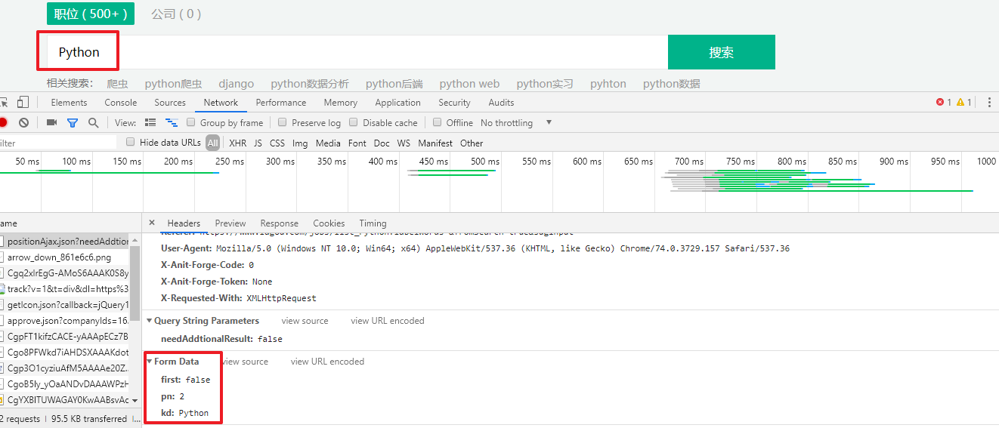
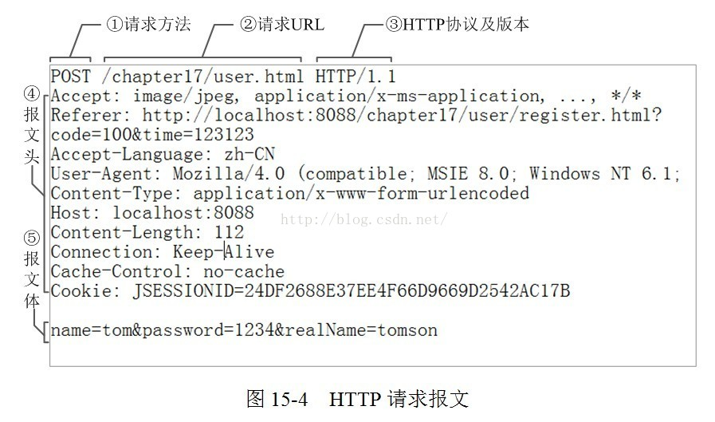
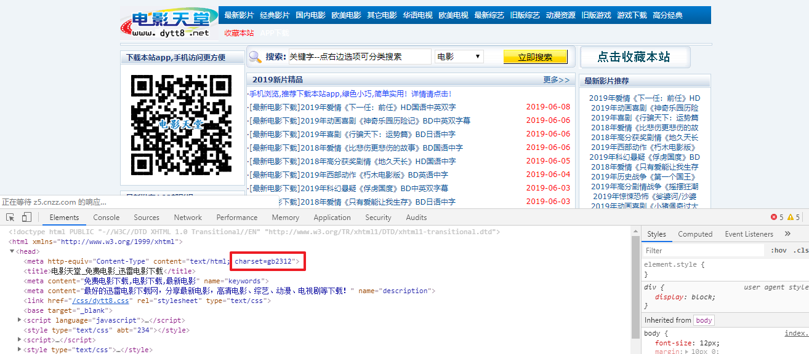
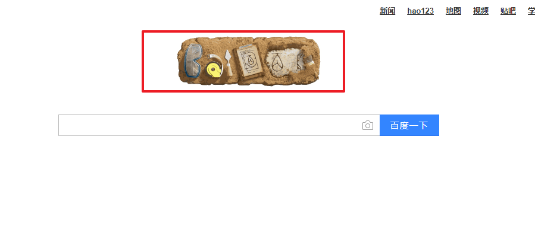
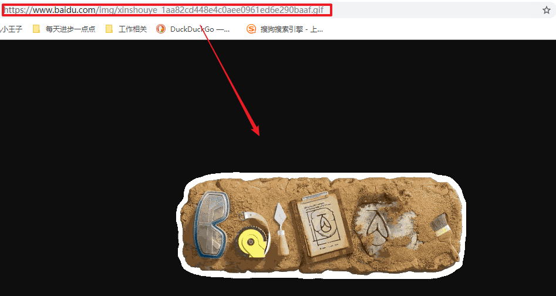
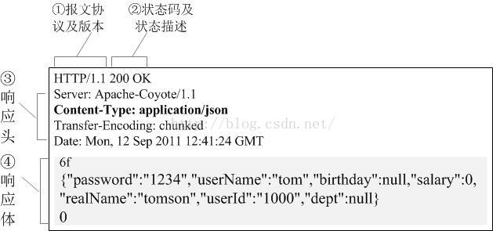

> Requests入门
>
> 中文文档：http://docs.python-requests.org/zh_CN/latest/index.html
>
> github地址：<https://github.com/requests/requests

我们可以在浏览器中抓取到这些请求与响应的内容，那么我们可以“伪造”请求吗？也就是不再通过浏览器发送这些数据，而是通过Python来模拟浏览器发送请求。答案是可行的。而Requests模块就可以完成这种功能。

- Requests 模块就是 Python 实现的简单易用的 **HTTP库**

还有其他库吗?  回答也是肯定的，例如 `urllib`，`urllib2` 等模块。但是目前来说 Requests 模块是最流行的。而且也是做好用的模块。

利用`pip`可以非常方便的安装：

```python
pip install requests
```

# 请求

## GET请求

使用 Requests 发送网络请求非常简单。

```python
import requests
response = requests.get('https://www.baidu.com')
print(response)
```

一开始要导入 Requests 模块然后，尝试获取某个网页。

本例子中，我们来获取百度官网首页

请求之后，我们有一个名为 response 的 **Response** 对象。直接打印后得到 **<Response [200]>** 这个是对象的名字，200位状态码

**Resposne**

response对象有一系列的方法与属性，常用的属性是 **response.text** 与 **response.encoding**

我们可以从这个对象中获取所有我们想要的信息。例如：打印出返回的文本的内容，查看网页的编码格式

实际上，如果我们在浏览器上打开这个网址， 右键选择“查看源代码”，你会发现，跟我们刚才打印出来的是一模一样(如果没有反爬或者网站是静态网站)。

也就是说，上面几行代码就已经帮我们把搜狗的首页的全部网页源码爬了下来。

### 请求参数

当我们爬一些特殊网址时，请求的url中会有一些特殊的参数，例如以下站点


这种是 **URL** 的查询参数。前面是网址，**？** 后面的二值性数据，就是查询参数。

URL 的查询字符串(query string)传递某种数据。如果你是手工构建 URL，也就是通过拼接字符串构造的URL。那么数据会以键/值对的形式置于 URL 中，跟在一个问号的后面。

例如： `https://image.so.com/i?q=%E9%A3%8E%E6%99%AF&src=srp` 


Requests 允许你使用 **params** 关键字参数，以一个字典来提供这些参数。

举例来说，如果你想传递 key1=value1 和 key2=value2 到 httpbin.org/get ，那么你可以使用如下代码：

```python
import requests
params = {'q': '风景'， 'src': 'srp'}
response = requests.get("https://image.so.com/i"， params=params)
```

通过打印输出该 URL，你能看到 URL 已被正确编码：

```python
print(response.url)
```

**网址拼接案例** 

同时也可以使用字符串拼接的形式构建参数，本质是一样的。

```python
import requests

q = '%E9%A3%8E%E6%99%AF'
src = 'srp'
color = 'orange'

so_image_str = 'https://image.so.com/i?q=' + q + '&src=' + src + '&color=' + color
# 发出请求
response = requests.get(so_image_str)
# 返回响应
print(response)
```

> **注意**：字典里值为 None 的键都不会被添加到 URL 的查询字符串里。

#### 请求头参数

我们的应对方案就是尽可能的模拟浏览器的功能或行为。既然浏览器有请求头的发送，那么我们的程序自然也应该加上。在Requests中我们通过 `headers` 参数添加请求头信息。

**案例：访问西刺网站**

```python
import requests
url = 'https://www.xicidaili.com/nn/'

headers = {
    'User-Agent': 'Mozilla/5.0 (Windows NT 10.0; Win64; x64) AppleWebKit/537.36 (KHTML, like Gecko) Chrome/77.0.3865.90 Safari/537.36'
}


response = requests.get(url='https://www.xicidaili.com/nn/', headers=headers)
print(response)
```

**注意：我们只是加上了User-Agent信息就可以正常访问了，但是浏览器是发送了比我们更多的信息的。如果遇到加上请求头User-Agent信息也不成功的网站，可以尝试添加其他请求头信息。**

请求头的添加在爬虫中是一种反爬机制的破解，也就是**反反爬虫**。

有些网站需要请求头才能得到数据，例如西刺，是通过请求头来反扒的

## POST请求

在HTTP请求中，最常见的就是GET请求和POST请求了，我们已经掌握了怎么处理GET请求，接下来我们处理较为复杂一些的POST请求。

POST请求主要用来提交表单数据，然后服务器根据表单数据进行分析，再决定返回什么样的数据给客户端。

**Form表单提交数据**

- Content-Type：application/x-www-form-urlencoded

在Requests中发送POST请求也是比较容易的操作，要实现这个，只需简单地传递一个**字典**给**data**参数。你的数据字典在发出请求时会自动编码为表单形式：

```python
data = {'key1': 'value1'， 'key2': 'value2'}
r = requests.post("http://httpbin.org/post"， data=data) 
```

当然Requests中的post方法只是相对于get方法多了一个data参数，其他参数都是类似的，例如我们也可以为post中的网址添加查询字符串 **params** 参数，也可以像get方法一样添加 **headers** 参数等。

**案例：千千音乐**

要求：百度搜索千千音乐，下载歌手中薛之谦的第一首歌

```python
import requests

url = 'http://play.taihe.com/data/music/songlink'

headers = {
    'Host': 'play.taihe.com',
    'Origin': 'http://play.taihe.com',
    'Referer': 'http://play.taihe.com/?__m=mboxCtrl.playSong&__a=242078437&fr=-1||-1',
    'User-Agent': 'Mozilla/5.0 (Windows NT 10.0; WOW64) AppleWebKit/537.36 (KHTML, like Gecko) Chrome/84.0.4128.3 Safari/537.36',
}

data = {
    "songIds": "242078437",
    "hq": "0",
    "type": "m4a,mp3",
    "rate": "",
    "pt": "0",
    "flag": "-1",
    "s2p": "-1",
    "prerate": "-1",
    "bwt": "-1",
    "dur": "-1",
    "bat": "-1",
    "bp": "-1",
    "pos": "-1",
    "auto": "-1",
}

response = requests.post(url=url, headers=headers, data=data)
print(response.text) 
```


### COOKIE

反扒除了用headers之外，有一些网站是使用cookie进行反扒。例如拉钩

**要求：** 爬取拉钩招聘数据，python关键字的第一页岗位数据

**案例：拉勾网数据采集案例** 




```python
import requests
import pprint
url = 'https://www.lagou.com/jobs/positionAjax.json'

cookie_str = '_ga=GA1.2.526104472.1560763129; user_trace_token=20190617171849-eaddd4fb-90e0-11e9-a399-5254005c3644; LGUID=20190617171849-eaddda87-90e0-11e9-a399-5254005c3644; sensorsdata2015jssdkcross=%7B%22distinct_id%22%3A%2216b657af0b8428-0bdd041c3f2ca2-6353160-2073600-16b657af0b983c%22%2C%22%24device_id%22%3A%2216b657af0b8428-0bdd041c3f2ca2-6353160-2073600-16b657af0b983c%22%2C%22props%22%3A%7B%22%24latest_traffic_source_type%22%3A%22%E7%9B%B4%E6%8E%A5%E6%B5%81%E9%87%8F%22%2C%22%24latest_referrer%22%3A%22%22%2C%22%24latest_referrer_host%22%3A%22%22%2C%22%24latest_search_keyword%22%3A%22%E6%9C%AA%E5%8F%96%E5%88%B0%E5%80%BC_%E7%9B%B4%E6%8E%A5%E6%89%93%E5%BC%80%22%7D%7D; _gid=GA1.2.1919896201.1578401797; index_location_city=%E5%85%A8%E5%9B%BD; JSESSIONID=ABAAABAAAIAACBI8BDD70782314475BDEF0EDF26AF5BAE6; WEBTJ-ID=20200107213430-16f8036c49f6ce-09da5212a130d5-67e1b3f-1327104-16f8036c4a0bf5; LGSID=20200107213431-6f9b8f27-3152-11ea-b1d7-525400f775ce; PRE_UTM=; PRE_HOST=www.baidu.com; PRE_SITE=https%3A%2F%2Fwww.baidu.com%2Flink%3Furl%3Dd4SNpmKeK5bu4C5sNEkVXcBmXtE72xFuQn8FOpVqOP_%26ck%3D9006.1.117.299.143.307.140.207%26shh%3Dwww.baidu.com%26sht%3Dbaidu%26wd%3D%26eqid%3Dc691588700344692000000065e1488e4; PRE_LAND=https%3A%2F%2Fwww.lagou.com%2F; TG-TRACK-CODE=index_search; SEARCH_ID=3ee4428f0a0148739fc67aeb60194187; X_HTTP_TOKEN=879c7dfac858e92378050487518625f50c75d75ed1; _gat=1; Hm_lvt_4233e74dff0ae5bd0a3d81c6ccf756e6=1578401797,1578404071,1578405087; Hm_lpvt_4233e74dff0ae5bd0a3d81c6ccf756e6=1578405087; LGRID=20200107215127-cd4c5a06-3154-11ea-a71a-5254005c3644'

headers = {
    'Host': 'www.lagou.com',
    'Origin': 'https://www.lagou.com',
    'Referer': 'https://www.lagou.com/jobs/list_python?labelWords=&fromSearch=true&suginput=',
    'User-Agent': 'Mozilla/5.0 (Windows NT 10.0; Win64; x64) AppleWebKit/537.36 (KHTML, like Gecko) Chrome/77.0.3865.90 Safari/537.36',
    'Cookie': cookie_str
}

# 查询参数
params = {
    'needAddtionalResult': 'false'
}

# 提交数据
json = {
    'first': 'true',
    'pn': '1',
    'kd': 'python'
}

response = requests.post(url=url, headers=headers, params=params, json=json)
print(response.text)  # 获取的是字符串


```


## 请求体

建立网站的最终目的是为了让人来访问，其实几乎每个网站都不欢迎爬虫。甚至现在越来越多的网站发现对方是爬虫程序的时候就会直接禁止该爬虫访问。也就是不会返回给爬虫任何信息，有的会返回提示：您当前属于非法访问！！

那网站服务器它怎么知道我们是爬虫呢？判断方式有很多，其中比较常见的就是通过请求头来判断。

在发送HTTP请求的时候**浏览器都会带上请求头信息**等，如果我们的程序没有带上，或者带上的请求头信息是错误的，也就是不被服务器认可的，那么就会遭到服务器的拒绝！

请求头的验证也是最简单的反爬虫策略了！


### 请求报文

一个HTTP请求报文由四个部分组成：请求行、请求头部、空行、请求数据。

#### 请求行

请求行由请求方法字段、URL字段和HTTP协议版本字段3个字段组成，它们用空格分隔。

比如 

```
GET /data/info.html HTTP/1.1
```

方法字段就是HTTP使用的请求方法，比如常见的GET/POST

其中HTTP协议版本有两种：HTTP1.0/HTTP1.1 可以这样区别：

HTTP1.0对于每个连接都只能传送一个请求和响应，请求就会关闭，HTTP1.0没有Host字段;而HTTP1.1在同一个连接中可以传送多个请求和响应，多个请求可以重叠和同时进行，HTTP1.1必须有Host字段。

```
import requests
response = requests.get('https://www.baidu.com')
print(response.request.headers)
```

#### 请求头部

HTTP客户程序(例如[浏览器](https://www.2cto.com/os/liulanqi/))，向服务器发送请求的时候必须指明请求类型(一般是GET或者 POST)。如有必要，客户程序还可以选择发送其他的请求头。大多数请求头并不是必需的，但Content-Length除外。对于POST请求来说 Content-Length必须出现。

常见的请求头字段含义：

**Accept：** 浏览器可接受的MIME类型。

**Accept-Charset：**浏览器可接受的字符集。

**Accept-Encoding：**浏览器能够进行解码的数据编码方式，比如gzip。Servlet能够向支持gzip的浏览器返回经gzip编码的HTML页面。许多情形下这可以减少5到10倍的下载时间。

**Accept-Language：**浏览器所希望的语言种类，当服务器能够提供一种以上的语言版本时要用到。

**Authorization：**授权信息，通常出现在对服务器发送的WWW-Authenticate头的应答中。

**Content-Length：**表示请求消息正文的长度。

**Host：** 客户机通过这个头告诉服务器，想访问的主机名。Host头域指定请求资源的Intenet主机和端口号，必须表示请求url的原始服务器或网关的位置。HTTP/1.1请求必须包含主机头域，否则[系统](https://www.2cto.com/os/)会以400状态码返回。

**If-Modified-Since：**客户机通过这个头告诉服务器，资源的缓存时间。只有当所请求的内容在指定的时间后又经过修改才返回它，否则返回304“Not Modified”应答。

**Referer：**客户机通过这个头告诉服务器，它是从哪个资源来访问服务器的(防盗链)。包含一个URL，用户从该URL代表的页面出发访问当前请求的页面。

**User-Agent：** User-Agent头域的内容包含发出请求的用户信息。浏览器类型，如果Servlet返回的内容与浏览器类型有关则该值非常有用。

**Cookie：**客户机通过这个头可以向服务器带数据，这是最重要的请求头信息之一。

**Pragma：**指定“no-cache”值表示服务器必须返回一个刷新后的文档，即使它是代理服务器而且已经有了页面的本地拷贝。

**From：**请求发送者的email地址，由一些特殊的Web客户程序使用，浏览器不会用到它。

**Connection：**处理完这次请求后是否断开连接还是继续保持连接。如果Servlet看到这里的值为“Keep- Alive”，或者看到请求使用的是HTTP 1.1(HTTP 1.1默认进行持久连接)，它就可以利用持久连接的优点，当页面包含多个元素时(例如Applet，图片)，显著地减少下载所需要的时间。要实现这一点，Servlet需要在应答中发送一个Content-Length头，最简单的实现方法是：先把内容写入 ByteArrayOutputStream，然后在正式写出内容之前计算它的大小。

**Range：**Range头域可以请求实体的一个或者多个子范围。例如，


UA-Pixels,UA-Color,UA-OS,UA-CPU：由某些版本的IE浏览器所发送的非标准的请求头，表示屏幕大小、颜色深度、操作系统和CPU类型。

#### 请求数据

若方法字段是GET，则此项为空，没有数据

若方法字段是POST，则通常来说此处放置的就是要提交的数据

比如要使用POST方法提交一个表单，其中有user字段中数据为“admin”， password字段为123456，那么这里的请求数据就是 user=admin&password=123456，使用&来连接各个字段。

总的来说，HTTP请求报文格式就如下图所示




上面是POST方法，它的请求行URL段中一般是没有参数的，参数放在了报文体中。而GET方法的参数直接置于请求行URL中，报文体则为空。

HTTP响应报文

同样的，HTTP响应报文也由三部分组成：响应行、响应头、响应体

# 响应

## 响应体

### 文本响应内容

我们能读取服务器响应的内容。在此之前我们使用 `r.text` 来访问服务器返回给我们的内容。并且我们可以看到返回的内容，神奇的是我们竟然没有做任何关于**编码解码**的事情。其实，

requests 会自动解码来自服务器的内容。大多数 Unicode 字符集都能被无缝地解码。

请求发出后，Requests 会基于 HTTP 头部对响应的编码作出有根据的**推测**。当你访问 `response.text` 之时，Requests 会使用其推测的文本编码。你可以找出 Requests 使用了什么编码，并且能够使用 r.encoding 属性来改变它：

```python
import requests

url = 'https://www.baidu.com'

response = requests.get(url=url)

print(response.text)
print(response.encoding)
```

如果你改变了编码，每当你访问 `response.text`，Request 都将会使用 `response.encoding` 的新值。

HTML 页面是可以设置编码信息的，可以查看该编码信息，然后设置 `response.encoding` 为相应的编码。这样就能使用正确的编码解析 `response.text` 了。而网页的编码可以在浏览器中去查看。

### 常见的响应方法

```
In [5]: response.
apparent_encoding     cookies               	history
iter_lines            ok						close                 
elapsed               is_permanent_redirect 	json                  
raise_for_status	  connection            	encoding              
is_redirect           links                 	raw                   
content               headers               	iter_content          
next                  reason					url
.....
```


##### 案例：电影天堂乱码案例

打开一个电影天堂，可以看到这个网站，表面上看着没有什么不同，但是当我们打开开发者工具查看编码的时候，我们会发现其实它是用的中文编码，如果我们直接使用的话，将会得不到正确的编码信息，结果机会呈现乱码。



```python
# 导入模块
import requests
# 电影天堂网站
url = 'https://www.dytt8.net'
# 发出请求
response = requests.get(url)
# 指定编码信息 gb2312 不指定就会出错
# response.encoding = 'gb2312'
# 查看返回信息
print(response.text)
```

### 二进制响应内容

你也能以二进制的方式访问请求响应体，对于非文本请求非常有用：

```python
r.content
```

Requests 会自动为你解码 gzip 和 deflate 传输编码的响应数据。

例如对于图片信息，可以很方便的保存到文件中。对于图片，mp3，视频等数据，往往要使用二进制的方式读取。

#### 案例：下载百度图片

这张图片是百度首页的图片，而且是gif图片：



这张图片的网址是：



- Python代码如下：

```python
'''
    baidu图片
'''
# 导入模块
import requests
# 百度图片的网站
url = 'https://www.baidu.com/img/xinshouye_1aa82cd448e4c0aee0961ed6e290baaf.gif'
# 发出请求
response = requests.get(url)
# 查看返回信息
print(response.content)
# 保存图片到本地
with open('picture.png'，'wb') as fp:
    fp.write(response.content)
```

### JSON 响应内容

Json数据也是爬虫经常见到的数据格式，Requests 中也有一个内置的 JSON 解码器，助你处理 JSON 数据：

```python
r.json()
```

如果 JSON 解码失败，r.json() 就会抛出一个异常。

例如：响应内容是 401 (Unauthorized)，尝试访问 r.json()将会抛出 ValueError: No JSON object could be decoded 异常。

需要注意的是，成功调用 r.json() 并不意味着响应的成功。有的服务器会在失败的响应中包含一个 JSON 对象（比如 HTTP 500 的错误细节）。这种 JSON 会被解码返回。要检查请求是否成功，请使用 r.raise_for_status() 或者检查 r.status_code 是否和你的期望相同。

#### 案例：抓取Github中的JSON文件

```python
'''
    https://github.com/timeline.json 网站
'''
# 导入模块
import requests
# github网址
url = 'https://github.com/timeline.json'
# 发送请求
response = requests.get(url)
# 查看响应数据
print(response.json()) # 注意有括号

```

结果是：

```python
{'message': 'Hello there， wayfaring stranger. If you’re reading this then you probably di
dn’t see our blog post a couple of years back announcing that this API would go away: htt
p://git.io/17AROg Fear not， you should be able to get what you need from the shiny new Events API instead.'， 'documentation_url': 'https://developer.github.com/v3/activity/events/#list-public-events'}

```

## 2.2 响应头

我们可以查看以一个 Python 字典形式展示服务器的响应头：

```python
r.headers
# 结果是
{'content-encoding': 'gzip'，    'transfer-encoding': 'chunked'，    'connection': 'close'，    'server': 'nginx/1.0.4'，    'x-runtime': '148ms'，    'etag': '"e1ca502697e5c9317743dc078f67693f"'，    'content-type': 'application/json'}

```

但是这个字典比较特殊：它是仅为 HTTP 头部而生的。根据 [RFC 2616](http://www.w3.org/Protocols/rfc2616/rfc2616-sec14.html)（HTTP1.1协议）， HTTP 头部是大小写不敏感的。

因此，我们可以使用任意大写形式来访问这些响应头字段：

```python
r.headers['Content-Type'] # 'application/json'
r.headers.get('content-type') # 'application/json'

```

## 2.3 状态码

响应状态码可以很方便的查看我们的响应状态，我们可以检测响应状态码：

```python
r = requests.get('http://httpbin.org/get')
r.status_code # 200

```

如果发送了一个错误请求(一个 4XX 客户端错误，或者 5XX 服务器错误响应)，我们可以通过 `response.raise_for_status()`来抛出异常：

```python
bad_r = requests.get('http://httpbin.org/status/404')
bad_r.status_code # 404
bad_r.raise_for_status() # 抛出异常
# 异常错误
Traceback (most recent call last):
  File "requests/models.py"， line 832， in raise_for_status
	raise http_errorrequests.exceptions.HTTPError: 404 Client Error

```

如果例子中 r 的 status_code 是 200 ，当我们调用 raise_for_status() 时，得到的是：

```python
r.raise_for_status() # 200
None
```

## 2.4 HTTP响应报文

HTTP响应报文也由三部分组成：响应行、响应头、响应体

### 响应行

响应行一般由协议版本、状态码及其描述组成 比如 HTTP/1.1 200 OK

其中协议版本HTTP/1.1或者HTTP/1.0，200就是它的状态码，OK则为它的描述。

//常见状态码：

100~199：表示成功接收请求，要求客户端继续提交下一次请求才能完成整个处理过程。

200~299：表示成功接收请求并已完成整个处理过程。常用200

300~399：为完成请求，客户需进一步细化请求。例如：请求的资源已经移动一个新地址、常用302(意味着你请求我，我让你去找别人)，307和304(我不给你这个资源，自己拿缓存)

400~499：客户端的请求有错误，常用404(意味着你请求的资源在web服务器中没有)403(服务器拒绝访问，权限不够)

500~599：服务器端出现错误，常用500

更详细的状态码信息

### 响应头

响应头用于描述服务器的基本信息，以及数据的描述，服务器通过这些数据的描述信息，可以通知客户端如何处理等一会儿它回送的数据。

设置HTTP响应头往往和状态码结合起来。例如，有好几个表示“文档位置已经改变”的状态代码都伴随着一个Location头，而401(Unauthorized)状态代码则必须伴随一个WWW-Authenticate头。然而，即使在没有设置特殊含义的状态代码时，指定应答头也是很有用的。应答头可以用来完成：设置Cookie，指定修改日期，指示浏览器按照指定的间隔刷新页面，声明文档的长度以便利用持久HTTP连接，……等等许多其他任务。

常见的响应头字段含义：

Allow：服务器支持哪些请求方法(如GET、POST等)。

Content-Encoding：文档的编码(Encode)方法。只有在解码之后才可以得到Content-Type头指定的内容类型。利用gzip压缩文档能够显著地减少HTML文档的下载时间。[Java](https://www.2cto.com/kf/ware/Java/)的GZIPOutputStream可以很方便地进行gzip压缩，但只有Unix上的Netscape和Windows上的IE4、IE5才支持它。因此，Servlet应该通过查看Accept-Encoding头(即request.getHeader(“Accept- Encoding”))检查浏览器是否支持gzip，为支持gzip的浏览器返回经gzip压缩的HTML页面，为其他浏览器返回普通页面。

Content-Length：表示内容长度。只有当浏览器使用持久HTTP连接时才需要这个数据。如果你想要利用持久连接的优势，可以把输出文档写入 ByteArrayOutputStram，完成后查看其大小，然后把该值放入Content-Length头，最后通过byteArrayStream.writeTo(response.getOutputStream()发送内容。

Content- Type：表示后面的文档属于什么MIME类型。Servlet默认为text/plain，但通常需要显式地指定为text/html。由于经常要设置 Content-Type，因此HttpServletResponse提供了一个专用的方法setContentType。

Date：当前的GMT时间，例如，Date:Mon，31Dec200104:25:57GMT。Date描述的时间表示世界标准时，换算成本地时间，需要知道用户所在的时区。你可以用setDateHeader来设置这个头以避免转换时间格式的麻烦。

Expires：告诉浏览器把回送的资源缓存多长时间，-1或0则是不缓存。

Last-Modified：文档的最后改动时间。客户可以通过If-Modified-Since请求头提供一个日期，该请求将被视为一个条件GET，只有改动时间迟于指定时间的文档才会返回，否则返回一个304(Not Modified)状态。Last-Modified也可用setDateHeader方法来设置。

Location：这个头配合302状态码使用，用于重定向接收者到一个新URI地址。表示客户应当到哪里去提取文档。Location通常不是直接设置的，而是通过HttpServletResponse的sendRedirect方法，该方法同时设置状态代码为302。

Refresh：告诉浏览器隔多久刷新一次，以秒计。

Server：服务器通过这个头告诉浏览器服务器的类型。Server响应头包含处理请求的原始服务器的软件信息。此域能包含多个产品标识和注释，产品标识一般按照重要性排序。Servlet一般不设置这个值，而是由Web服务器自己设置。

Set-Cookie：设置和页面关联的Cookie。Servlet不应使用response.setHeader(“Set-Cookie”， …)，而是应使用HttpServletResponse提供的专用方法addCookie。

Transfer-Encoding：告诉浏览器数据的传送格式。

WWW-Authenticate：客户应该在Authorization头中提供什么类型的授权信息?在包含401(Unauthorized)状态行的应答中这个头是必需的。例如，response.setHeader(“WWW-Authenticate”， “BASIC realm=\”executives\”“)。注意Servlet一般不进行这方面的处理，而是让Web服务器的专门机制来控制受密码保护页面的访问。

注：设置应答头最常用的方法是HttpServletResponse的setHeader，该方法有两个参数，分别表示应答头的名字和值。和设置状态代码相似，设置应答头应该在发送任何文档内容之前进行。

setDateHeader方法和setIntHeadr方法专门用来设置包含日期和整数值的应答头，前者避免了把Java时间转换为GMT时间字符串的麻烦，后者则避免了把整数转换为字符串的麻烦。

HttpServletResponse还提供了许多设置

setContentType：设置Content-Type头。大多数Servlet都要用到这个方法。

setContentLength：设置Content-Length头。对于支持持久HTTP连接的浏览器来说，这个函数是很有用的。

addCookie：设置一个Cookie(Servlet API中没有setCookie方法，因为应答往往包含多个Set-Cookie头)。

### 响应体

响应体就是响应的消息体，如果是纯数据就是返回纯数据，如果请求的是HTML页面，那么返回的就是HTML代码，如果是JS就是JS代码，如此之类。

HTTP响应报文格式就如下图所示



### 响应内容

看到的网页文件

# 重定向与请求历史

### 重定向

[重定向](https://baike.baidu.com/item/%E9%87%8D%E5%AE%9A%E5%90%91/9064196) (Redirect)就是通过各种方法将一个网络请求重新定个方向转到其它位置。可能的原因是有些网址现在已经废弃不准备再使用等。

### 处理重定向

默认情况下，对于我们常用的 GET 和 POST 请求等， Requests 会自动处理所有重定向。例如，Github 将所有的 HTTP 请求重定向到 HTTPS：

```python
r = requests.get('http://github.com')
r.url # 'https://github.com/'
r.status_code # 200

```

如果你使用的是GET、POST等，那么你可以通过 `allow_redirects` 参数禁用重定向处理：

```python
r = requests.get('http://github.com'， allow_redirects=False)
r.status_code # 301

```

可以使用响应对象的 `history` 方法来追踪重定向。Response.history是一个 [**Response**](#requests.Response) 对象的列表，为了完成请求而创建了这些对象。这个对象列表按照从最老到最近的请求进行排序。

```python
r = requests.get('http://github.com')
r.history # [<Response [301]>]

```

## 1.4 超时

有时候我们由于时间或者对方网站的原因，不想等待很长的时间，等待响应的回传，那么我们就可以加上一个时间超时参数，如果超过我们设定的时间，响应还没有返回，那么久不再等待。

你可以告诉 requests 在经过以 `timeout` 参数设定的秒数时间之后停止等待响应。建议所有的生产代码都应该使用这一参数。

```python
requests.get('http://github.com'， timeout=0.001)
# 报错结果
Traceback (most recent call last):
    File "<stdin>"， line 1， in <module>requests.exceptions.Timeout
    HTTPConnectionPool(host='github.com'， port=80): Request timed out. (timeout=0.001)

```

## 1.5 错误与异常

遇到网络问题（如：DNS 查询失败、拒绝连接等）时，Requests 会抛出一个 `ConnectionError` 异常。

1. 如果 HTTP 请求返回了不成功的状态码， Response.raise_for_status() 会抛出一个 `HTTPError` 异常。
2. 若请求超时，则抛出一个 `Timeout` 异常。
3. 若请求超过了设定的最大重定向次数，则会抛出一个 `TooManyRedirects` 异常。

所有Requests显式抛出的异常都继承自 `requests.exceptions.RequestException` 。


## 参考阅读：编码

很久很久以前，有一群人，他们决定用8个可以开合的晶体管来组合成不同的状态，以表示世界上的万物。他们看到8个开关状态是好的，于是他们把这称为"字节"。

再后来，他们又做了一些可以处理这些字节的机器，机器开动了，可以用字节来组合出很多状态，状态开始变来变去。他们看到这样是好的，于是它们就这机器称为"计算机"。

开始计算机只在美国用。八位的字节一共可以组合出256(2的8次方)种不同的状态。

他们把其中的编号从0开始的32种状态分别规定了特殊的用途，一但终端、打印机遇上约定好的这些字节被传过来时，就要做一些约定的动作。遇上00x10， 终端就换行，遇上0x07， 终端就向人们嘟嘟叫，例好遇上0x1b， 打印机就打印反白的字，或者终端就用彩色显示字母。他们看到这样很好，于是就把这些0x20以下的字节状态称为"控制码"。

他们又把所有的空格、标点符号、数字、大小写字母分别用连续的字节状态表示，一直编到了第127号，这样计算机就可以用不同字节来存储英语的文字了。大家看到这样，都感觉很好，于是大家都把这个方案叫做 ANSI 的"Ascii"编码（American Standard Code for Information Interchange，美国信息互换标准代码）。当时世界上所有的计算机都用同样的ASCII方案来保存英文文字。

后来，就像建造巴比伦塔一样，世界各地的都开始使用计算机，但是很多国家用的不是英文，他们的字母里有许多是ASCII里没有的，为了可以在计算机保存他们的文字，他们决定采用127号之后的空位来表示这些新的字母、符号，还加入了很多画表格时需要用下到的横线、竖线、交叉等形状，一直把序号编到了最后一个状态255。从128到255这一页的字符集被称"扩展字符集"。从此之后，贪婪的人类再没有新的状态可以用了，美帝国主义可能没有想到还有第三世界国家的人们也希望可以用到计算机吧！

等中国人们得到计算机时，已经没有可以利用的字节状态来表示汉字，况且有6000多个常用汉字需要保存呢。但是这难不倒智慧的中国人民，我们不客气地把那些127号之后的奇异符号们直接取消掉， 规定：一个小于127的字符的意义与原来相同，但两个大于127的字符连在一起时，就表示一个汉字，前面的一个字节（他称之为高字节）从0xA1用到0xF7，后面一个字节（低字节）从0xA1到0xFE，这样我们就可以组合出大约7000多个简体汉字了。在这些编码里，我们还把数学符号、罗马希腊的字母、日文的假名们都编进去了，连在 ASCII 里本来就有的数字、标点、字母都统统重新编了两个字节长的编码，这就是常说的"全角"字符，而原来在127号以下的那些就叫"半角"字符了。

中国人民看到这样很不错，于是就把这种汉字方案叫做 "GB2312"。GB2312 是对 ASCII 的中文扩展。

但是中国的汉字太多了，我们很快就就发现有许多人的人名没有办法在这里打出来，特别是某些很会麻烦别人的国家领导人。于是我们不得不继续把 GB2312 没有用到的码位找出来老实不客气地用上。

后来还是不够用，于是干脆不再要求低字节一定是127号之后的内码，只要第一个字节是大于127就固定表示这是一个汉字的开始，不管后面跟的是不是扩展字符集里的内容。结果扩展之后的编码方案被称为 GBK 标准，GBK 包括了 GB2312 的所有内容，同时又增加了近20000个新的汉字（包括繁体字）和符号。

后来少数民族也要用电脑了，于是我们再扩展，又加了几千个新的少数民族的字，GBK 扩成了 GB18030。从此之后，中华民族的文化就可以在计算机时代中传承了。

中国的程序员们看到这一系列汉字编码的标准是好的，于是通称他们叫做 "DBCS"（Double Byte Charecter Set 双字节字符集）。在DBCS系列标准里，最大的特点是两字节长的汉字字符和一字节长的英文字符并存于同一套编码方案里，因此他们写的程序为了支持中文处理，必须要注意字串里的每一个字节的值，如果这个值是大于127的，那么就认为一个双字节字符集里的字符出现了。那时候凡是受过加持，会编程的计算机僧侣们都要每天念下面这个咒语数百遍：

"一个汉字算两个英文字符！一个汉字算两个英文字符……"

因为当时各个国家都像中国这样搞出一套自己的编码标准，结果互相之间谁也不懂谁的编码，谁也不支持别人的编码，连大陆和台湾这样只相隔了150海里，使用着同一种语言的兄弟地区，也分别采用了不同的 DBCS 编码方案——当时的中国人想让电脑显示汉字，就必须装上一个"汉字系统"，专门用来处理汉字的显示、输入的问题，但是那个台湾的愚昧封建人士写的算命程序就必须加装另一套支持 BIG5 编码的什么"倚天汉字系统"才可以用，装错了字符系统，显示就会乱了套！这怎么办？而且世界民族之林中还有那些一时用不上电脑的穷苦人民，他们的文字又怎么办？

真是计算机的巴比伦塔命题啊！

正在这时，大天使加百列及时出现了——一个叫 ISO （国际标谁化组织）的国际组织决定着手解决这个问题。他们采用的方法很简单：废了所有的地区性编码方案，重新搞一个包括了地球上所有文化、所有字母和符号的编码！他们打算叫它"Universal Multiple-Octet Coded Character Set"，简称 UCS， 俗称 "UNICODE"。

UNICODE 开始制订时，计算机的存储器容量极大地发展了，空间再也不成为问题了。于是 ISO 就直接规定必须用两个字节，也就是16位来统一表示所有的字符，对于ascii里的那些“半角”字符，UNICODE 包持其原编码不变，只是将其长度由原来的8位扩展为16位，而其他文化和语言的字符则全部重新统一编码。由于"半角"英文符号只需要用到低8位，所以其高8位永远是0，因此这种大气的方案在保存英文文本时会多浪费一倍的空间。

这时候，从旧社会里走过来的程序员开始发现一个奇怪的现象：他们的strlen函数靠不住了，一个汉字不再是相当于两个字符了，而是一个！是的，从 UNICODE 开始，无论是半角的英文字母，还是全角的汉字，它们都是统一的"一个字符"！同时，也都是统一的"两个字节"，请注意"字符"和"字节"两个术语的不同，“字节”是一个8位的物理存贮单元，而“字符”则是一个文化相关的符号。在UNICODE 中，一个字符就是两个字节。一个汉字算两个英文字符的时代已经快过去了。

从前多种字符集存在时，那些做多语言软件的公司遇上过很大麻烦，他们为了在不同的国家销售同一套软件，就不得不在区域化软件时也加持那个双字节字符集咒语，不仅要处处小心不要搞错，还要把软件中的文字在不同的字符集中转来转去。UNICODE 对于他们来说是一个很好的一揽子解决方案，于是从 Windows NT 开始，MS 趁机把它们的操作系统改了一遍，把所有的核心代码都改成了用 UNICODE 方式工作的版本，从这时开始，WINDOWS 系统终于无需要加装各种本土语言系统，就可以显示全世界上所有文化的字符了。

但是，UNICODE 在制订时没有考虑与任何一种现有的编码方案保持兼容，这使得 GBK 与UNICODE 在汉字的内码编排上完全是不一样的，没有一种简单的算术方法可以把文本内容从UNICODE编码和另一种编码进行转换，这种转换必须通过查表来进行。

如前所述，UNICODE 是用两个字节来表示为一个字符，他总共可以组合出65535不同的字符，这大概已经可以覆盖世界上所有文化的符号。如果还不够也没有关系，ISO已经准备了UCS-4方案，说简单了就是四个字节来表示一个字符，这样我们就可以组合出21亿个不同的字符出来（最高位有其他用途），这大概可以用到银河联邦成立那一天吧！

UNICODE 来到时，一起到来的还有计算机网络的兴起，UNICODE 如何在网络上传输也是一个必须考虑的问题，于是面向传输的众多 UTF（UCS Transfer Format）标准出现了，顾名思义，UTF8就是每次8个位传输数据，而UTF16就是每次16个位，只不过为了传输时的可靠性，从UNICODE到UTF时并不是直接的对应，而是要过一些算法和规则来转换。

### 总结：

- 字符(Character)是各种文字和符号的总称，包括各国家文字、标点符号、图形符号、数字等。字符集(Character set)是多个字符的集合
- 字符集包括：ASCII字符集、GB2312字符集、GB18030字符集、Unicode字符集等
- ASCII编码是1个字节，而Unicode编码通常是2个字节。
- UTF-8是Unicode的实现方式之一，UTF-8是它是一种变长的编码方式，可以是1，2，3个字节

