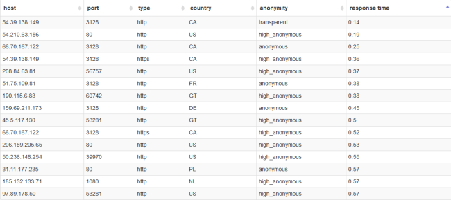
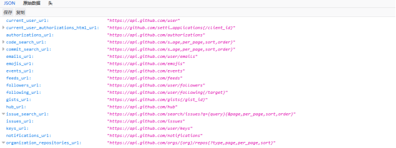
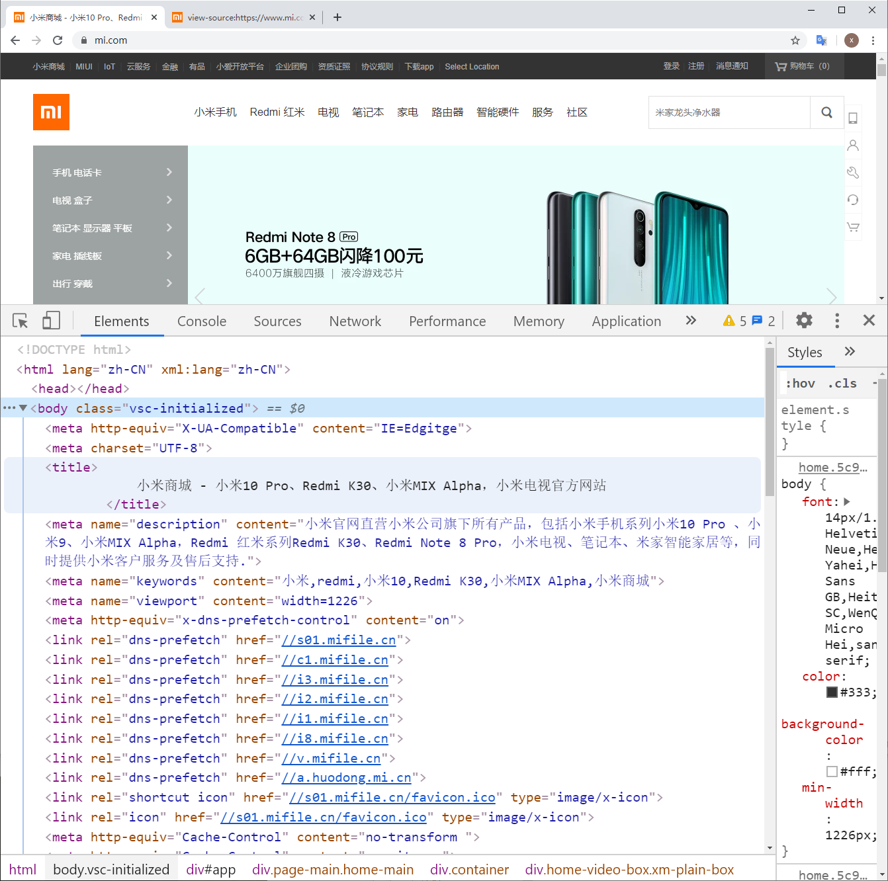

# 数据解析

##  结构化数据

结构化的数据是指可以使用关系型数据库表示和存储，表现为二维形式的数据。一般特点是：数据以行为单位，一行数据表示一个实体的信息，每一行数据的属性是相同的。



## 半结构化数据

非关系模型的、有基本固定结构模式的数据，例如日志文件、XML文档、JSON文档等。

<http://www.bejson.com/jsoneditoronline/> 这个也是json文件。



## 非结构化数据

顾名思义，就是没有固定结构的数据。各种文档、图片、视频/音频等都属于非结构化数据。对于这类数据，我们一般直接整体进行存储，而且一般存储为二进制的数据格式。

能看懂的就是结构化的数据，看不懂的，就是非结构化数据

# HTML

- HTML 指的是超文本标记语言 (**H**yper **T**ext **M**arkup **L**anguage)是用来描述网页的一种语言。
- H（很）T（甜）M（蜜）L（啦）
- HTML 不是一种编程语言，而是一种标记语言 (markup language)
- 标记语言是一套标记标签 (markup tag)

**所谓超文本，有2层含义：** 

1. 因为它可以加入图片、声音、动画、多媒体等内容（**超越文本限制 **）
2. 不仅如此，它还可以从一个文件跳转到另一个文件，与世界各地主机的文件连接（**超级链接文本 **）。

```html
<h1> 我是一个大标题 </h1>
```

**一句话说出他们:**

> 网页是由网页元素组成的 ， 这些元素是利用html标签描述出来，然后通过浏览器解析，就可以显示给用户了。

**门外汉眼中的效果页面**


**爬虫工程是中的页面**



## HTML骨架格式

日常生活的书信，我们要遵循共同的约定。 


同理：HTML 有自己的语言语法骨架格式：（要遵循，要专业） 要求务必非常流畅的默写下来。。

```html
<html>   
    <head>     
        <title></title>
    </head>
    <body>
    </body>
</html>
```

#### html骨架标签总结

| 标签名           |    定义    | 说明                                                    |
| ---------------- | :--------: | :------------------------------------------------------ |
| <html></html>    |  HTML标签  | 页面中最大的标签，我们成为  根标签                      |
| <head></head>    | 文档的头部 | 注意在head标签中我们必须要设置的标签是title             |
| <titile></title> | 文档的标题 | 让页面拥有一个属于自己的网页标题                        |
| <body></body>    | 文档的主体 | 元素包含文档的所有内容，页面内容 基本都是放到body里面的 |
| <titile></title> | 文档的标题 | 让页面拥有一个属于自己的网页标题                        |

**课堂练习： **   

书写我们的第一个HTML 页面。

1. 新建一个demo 的 TXT 文件。

2. 里面写入刚才的HTML 骨架。  

3. 把后缀名改为 .HTML。

4. 右击--谷歌浏览器打开。

   ```html
   <html>   
       <head>     
           <title>我的第一个页面</title>
       </head>
       <body>
             hello world ！
       </body>
   </html>
   ```


为了便于记忆，我们请出刚才要辞职回家养猪的二师兄来帮忙， 我称之为  猪八戒记忆法


## HTML标签关系

主要针对于**双标签** 的相互关系分为两种：  请大家务必熟悉记住这种标签关系，因为后面我们标签嵌套特别多，很容易弄混他们的关系。

1. 嵌套关系

```html
<head>  
	<title> </title> 
</head>
```


2.并列关系

```html
<head></head>
<body></body>
```


**倡议：** 

> ```html
> 如果两个标签之间的关系是嵌套关系，子元素最好缩进一个tab键的身位（一个tab是4个空格）。如果是并列关系，最好上下对齐。
> ```

**一句话说出他们:**

> html双标签 可以分为  有 一种是 父子级 包含关系的标签      一种是 兄弟级 并列关系的标签


# CSS选择器

在 CSS 中，选择器是一种模式，用于选择需要添加样式的元素。

"CSS" 列指示该属性是在哪个 CSS 版本中定义的。（CSS1、CSS2 还是 CSS3。）

w3c指南：<https://www.w3school.com.cn/cssref/css_selectors.ASP>

| 选择器                 | 例子            | 例子描述                                 |
| :--------------------- | :-------------- | :--------------------------------------- |
| .*class*               | .intro          | 选择 class="intro" 的所有元素。          |
| #id                    | #firstname      | 选择 id="firstname" 的所有元素。         |
| *                      | *               | 选择所有元素。                           |
| element                | p               | 选择所有 <p> 元素。                      |
| *element*,*element*    | div,p           | 选择所有 <div> 元素和所有 <p> 元素。     |
| *element* *element*    | div p           | 选择 <div> 元素内部的所有 <p> 元素。     |
| *element*>*element*    | div>p           | 选择父元素为 <div> 元素的所有 <p> 元素。 |
| [*attribute*\]         | [target]        | 选择带有 target 属性所有元素。           |
| [*attribute*=*value*\] | [target=_blank] | 选择 target="_blank" 的所有元素。        |

## 3.1 标签选择器

标签选择器其实就是我们经常说的html代码中的标签。例如html、span、p、div、a、img等等；比如我们想要设置网页中的p标签内一段文字的字体和颜色，那么css代码就如下所示：

```
import parsel

html = """
<!DOCTYPE html>
<html lang="en">
<head>
    <meta charset="UTF-8">
    <title>标签选择器</title>
</head>
<style>
    p{
        color: #f00;
        font-size: 16px;
    }
</style>
<body>
<p>css标签选择器的介绍</p>
<p>标签选择器、类选择器、ID选择器</p>
<a href="https://www.baidu.com">百度一下</a>
<span> 我是一个span标签</span>
</body>
</html>
"""


selector = parsel.Selector(html)

p = selector.css('body')

print(p.getall())

```

## 3.2 类选择器

类选择器在我们今后的css样式编码中是最常用到的，它是通过为元素设置单独的class来赋予元素样式效果。

**使用语法：**（我们这里为p标签单独设置一个类选择器.content,代码就如下所示）

```
import parsel

html = """
<!DOCTYPE html>
<html lang="en">
<head>
    <meta charset="UTF-8">
    <title>标签选择器</title>
</head>
<style>
    p{
        color: #f00;
        font-size: 16px;
    }
</style>
<body>
<p>css标签选择器的介绍</p>
<p>标签选择器、类选择器、ID选择器</p>
<a href="https://www.baidu.com">百度一下</a>
<span> 我是一个span标签</span>
</body>
</html>
"""


selector = parsel.Selector(html)

p = selector.css('.p')

print(p.getall())
```

**详细讲解：**

1、类选择器都是使用英文圆点（.）开头；

2、每个元素可以有多个类名，，名称可以任意起名（但不要起中文，一般都是与内容相关的英文缩写）

3、类选择器只会改变类下的元素样式，而不会改变其它标签的默认样式；

我们上边的页面在浏览器上显示的效果就如下所示：（content下的文字内容颜色变成了红色，字体变成了16px）

## 3.3 ID选择器

ID选择器类似于类选择符，作用同类选择符相同，但也有一些重要的区别。

**使用语法：**

```
<!DOCTYPE html>
<html lang="en">
<head>
    <meta charset="UTF-8">
    <title>ID择器</title>
</head>
<style>
    #content{
        color: #f00;
        font-size: 16px;
    }
</style>
<body>
<p>css标签选择器的介绍</p>
<p id="content">标签选择器、类选择器、ID选择器</p>
</body>
</html>
```

**详细讲解：**

1、ID选择器为标签设置id="ID名称"，而不是class="类名称"。

2、ID选择符的前面是符号为井号（#），而不是英文圆点（.）。

3、ID选择器的名称是唯一的，即相同名称的id选择器在一个页面只能出现一次；

## 3.4 组合选择器

可以多个选择器一起使用，就是组合选择器


## 3.5 伪类选择器

可以用 :: 指定选择标签的属性。

| :last-child        | p:last-child        | 选择所有p元素的最后一个子元素          |
| ------------------ | ------------------- | -------------------------------------- |
| :last-of-type      | p:last-of-type      | 选择每个p元素是其母元素的最后一个p元素 |
| :not(selector)     | :not(p)             | 选择所有p以外的元素                    |
| :nth-child(n)      | p:nth-child(2)      | 选择所有 p 元素的父元素的第二个子元素  |
| :nth-last-child(n) | p:nth-last-child(2) | 选择所有p元素倒数的第二个子元素        |

## 3.6 属性提取器

```python
import requests
import parsel

headers = {
    'User-Agent': 'Mozilla/5.0 (Windows NT 10.0; Win64; x64) AppleWebKit/537.36 (KHTML, like Gecko) Chrome/77.0.3865.90 Safari/537.36'
}

response = requests.get('https://maoyan.com/board/4?offset=0', headers=headers)
html = response.text

# %% 标签选择器
sel = parsel.Selector(html)
# 提取 p 标签
ps = sel.css('p')
for p in ps:
    print(p.get())

# %% 类（class）选择器
ps = sel.css('.star')
for p in ps:
    print(p.get())

# %% id选择器
ps = sel.css('#app')
for p in ps:
    print(p.get())

# %% 组合选择器
# ps = sel.css('#app .star')
ps = sel.css('div#app .star')
for p in ps:
    print(p.get())

# %% 伪类选择器
# ps = sel.css('#app .star')
ps = sel.css('div#app .star::text')
for p in ps:
    print(p.get())

# %% 属性选择器
names = sel.css('p.name a::attr(title)').extract()
print(names)

# %% 案例:猫眼电影
```

