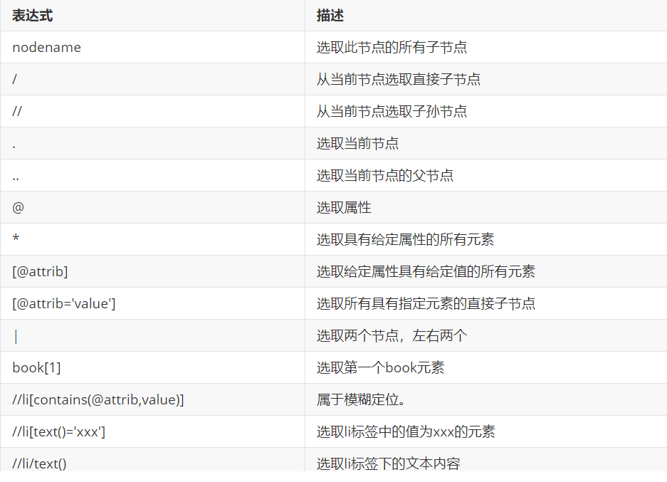

# 1. 正则表达式

**正则表达式**，又称规则表达式**。**（英语：Regular Expression，在代码中常简写为regex、regexp或RE），计算机科学的一个概念。正则表达式通常被用来检索、替换那些符合某个模式(规则)的文本。——百度百科


下面是正则表达式常见的使用场景：

1. 检查字符串的合法性
   - 验证用户名  （a-z，0-9，不能全是数字，不能全是字母）
   - 验证邮箱格式 (xxx@qq.com)
   - 验证电话号码 (11位数字)
   - 验证身份证   (18位 )
   - 验证QQ号码格式（5-12纯数字，第一位不能为0）；
2. 提取字符串中信息
   - 提取一条短信中数字；
   - 提取文件名的后缀；
   - **采集器(网络爬虫)** 
3. 替换字符串
   - 替换字符串中的非法字符；
   - 对电话号码进行屏蔽；（1852****0102）
   - 替换占位符 “hello {{name}} ”  hello 王老二 （模板框架）
4. 分割字符串
   - 将一个字符串按照指定的规则进行分割；

在爬虫中，使用正则表达式提取我们想要的数据。去掉多余的数据。

**场景：找所有邮件地址**

> 百度贴吧邮箱信息：http://tieba.baidu.com/p/5781191467

```
text = """
回复(2)4楼2018-07-04 11:48

哥哥口袋有糖
初识物联1
346504108@qq.com

收起回复5楼2018-07-04 14:10

Super劫Zed: 540775360@qq.com
2018-8-8 16:00回复
我也说一句

RAVV2017
物联硕士4
以上的邮箱，已发，还需要的请回复邮箱。两套物联网学习资料。

回复(4)7楼2018-07-04 16:06

儒雅的刘飞3
初识物联1
397872410@qq.com，谢谢楼主

收起回复8楼2018-07-04 16:20

RAVV2017: 已发送，麻烦请查收，谢谢
2018-7-4 16:23回复
我也说一句
 
该来的总会来
物联博士5
1459543548@qq.com
谢谢谢谢

回复9楼2018-07-04 17:18来自Android客户端
BLACKPINK_罗捷
深入物联2
1228074244@qq.com
"""
```

```
346504108@qq.com
Super劫Zed: 540775360@qq.com
397872410@qq.com，谢谢楼主
1459543548@qq.com
```

### 1.1 元字符

> 使用元字符匹配单个字符

| 字符 | 功能                                         |
| ---- | -------------------------------------------- |
| .    | 匹配任意1个字符（除了\n）                    |
| [ ]  | 匹配[ ]中列举的字符                          |
| \d   | 匹配数字，即0-9                              |
| \D   | 匹配非数字，即不是数字                       |
| \s   | 匹配空白，即 空格，tab键，换行               |
| \S   | 匹配非空白（数字、英文字符、特殊符号）       |
| \w   | 匹配单词字符，即a-z、A-Z、0-9、_             |
| \W   | 匹配非单词字符                               |
| *    | 匹配前一个字符出现0次或者无限次，即可有可无  |
| +    | 匹配前一个字符出现1次或者无限次，即至少有1次 |

#### \d匹配数字

```python
#coding=utf-8

import re

res = re.findall("\d"，'346504108@qq.com')
print(res)
```

运行结果：

```python
['3'， '4'， '6'， '5'， '0'， '4'， '1'， '0'， '8']
```


#### + * 匹配多个字符

```python
import re

res = re.findall("\d+"，'346504108@qq.com')
print(res)
```

运行结果：

```python
['346504108']
```


#### \d与`[]`(字符集)

可能会出现的一些情况

[123456zxcv] 字符集只能匹配一个出现在集合里面的值

\d代表0到9的所有数字，[0123456789] 与\d等效

```python
import re

res = re.findall("\d+"，'346504108@qq.com')
print(res)

res1 = re.findall("[0123456789]+"，'346504108@qq.com')
print(res1)
```

运行结果：

```python
['346504108']
['346504108']
```

思考：邮箱可能出现为字符串，该如何处理？

例如：`yanglong985@163.com `

提示: `[a-z]`


#### 使用点匹配任意字符

案例：匹配中国电信手机号码

- 中国电信号段
  133. 153. 180. 189 
- 号码总长度为11位

实现方式：

1. 编写电信号码的正则
2. 进行匹配
3. 打印结果

```
import re
str_phone = """13357024777
电信 浙江省 衢州 尾数AAA 号码吉凶
18948121234 
电信 广东省 茂名 尾数ABCD 号码吉凶
13873179698 
移动 湖南省 长沙 个性靓号 号码吉凶
15802648889 
移动 湖南省 长沙 尾数AAABAAAB号码吉凶
"""

# 第一位都是以1开头 第二位可以为34578 第三位没有6与9 后面都是数字
res = re.findall('1[358][039]\d+'， str_phone)
print(res)

```

#### 使用.*匹配任意多个字符

思考：匹配 `Hello` 与 `Demo` 之间的内容

```python
import re
content = 'Hello 1234567 World_This is a Rexgex Demo'
result = re.findall('Hel.* Rexgex Demo'， content)
print(result)

```


### 1.2 数量词

> 使用数量词匹配多个字符

| 字符  | 功能                       |
| ----- | -------------------------- |
| {m}   | 匹配前一个字符出现m次      |
| {m,n} | 匹配前一个字符出现从m到n次 |

需求：匹配出，8到20位的密码，可以是大小写英文字母、数字、下划线

```python
#coding=utf-8
import re

res = re.findall("[a-zA-Z0-9]{8}"，"ash2e223 3424kjkljkljf 34523nmkdsjf")
print(res)

ret = re.findall("[a-zA-Z0-9_]{8，20}"，"ash2e223 3424kjkljkljf 34523nmkdsadsjf")
print(ret)

```


案例：`QQ` 号码匹配

- `QQ` 号规则
  1. 第一位数字不能为0
  2. 可能是 5-12 位

```python
qq_str = """
346504108@qq.com
Super劫Zed: 540775360@qq.com
397872410@qq.com，谢谢楼主
1459543548@qq.com
"""

ret = re.findall("[1-9][0-9]{4，11}"，qq_str)
print(ret)

```

运行结果：

```python
['346504108'， '540775360'， '397872410'， '1459543548']

```

### 1.3 精确匹配与泛匹配

#### 泛匹配

泛匹配是匹配所有的东西

```python
import re

content = 'Hello 1234567 World_This is a Rexgex Demo'

result = re.find('Hello.*Demo'， content)
print(result)

```

#### 精确匹配

精确匹配是匹配括号里面的东西

```python
import re

content = 'Hello 1234567 World_This is a Rexgex Demo'
result = re.findall('Hello (\d+).*Demo'， content)
print(result)

```

### 1.4 贪婪匹配与非贪婪匹配

Python里数量词默认是贪婪的（在少数语言里也可能是默认非贪婪），总是尝试匹配尽可能多的字符；

非贪婪则相反，总是尝试匹配尽可能少的字符。

在"*"，"?"，"+"，"{m,n}"后面加上？，使贪婪变成非贪婪。

```python
import re
content = 'Hello 1234567 World_This is a Rexgex Demo'
result = re.findall('Hel.*(\d+)'， content)
print(result)

```

正则表达式模式中使用到通配字，那它在从左到右的顺序求值时，会尽量“抓取”满足匹配最长字符串，在我们上面的例子里面，“.+”会从字符串的启始处抓取满足模式的最长字符，其中包括我们想得到的第一个整型字段的中的大部分，“\d+”只需一位字符就可以匹配，所以它匹配了数字“4”，而“.+”则匹配了从字符串起始到这个第一位数字4之前的所有字符。

解决方式：非贪婪操作符“？”，这个操作符可以用在"*"，"+"，"?"的后面，要求正则匹配的越少越好。

http://bulletin.sntba.com/biddingBulletin/2020-01-09/158090.html

# 2. re模块

一直以来我们都是使用 `re.search()` 函数，其实在正则表达式模块中还有一些函数可以很方便的对字符串进行操作。`re`模块的使用可以分为两种：第一种是**对象式的方式**，第二种是**函数式的方式**。

### re.match

`match()` 用于查找字符串的头部（也可以指定**起始位置**），它是**一次匹配**，只要找到了一个匹配的结果就返回，而不是查找所有匹配的结果。它的一般使用形式如下：

```python
match(pattern， string[， flag])
```

其中，`pattern`是正则表达式规则字符串，`string` 是待匹配的字符串，`flag` 是可选参数。

当匹配成功时，返回一个 `Match` 对象，如果没有匹配上，则返回 `None`。

```python
# 导入模块
import re
# 正则
pattern = 'Python'
# 字符串
string = 'PythonahsdgjasghPythonasdjajsk'
# 匹配
result = re.match(pattern， string)
# 结果
print(result)
```

### re.search

`search()` 用于查找字符串的任何位置，它也是一次匹配，只要找到了一个匹配的结果就返回，而不是查找所有匹配的结果，它的一般使用形式如下：

```python
search(pattern， string[， flag])
```

当匹配成功时，返回一个 `Match` 对象，如果没有匹配上，则返回 `None`。

```
ret = re.search('\d+', "python = 9999， c = 7890， c++ = 12345")
ret.group()
```

### re.findall

上面的 `match` 和 `search` 方法都是一次匹配，只要找到了一个匹配的结果就返回。然而，在大多数时候，我们需要搜索整个字符串，获得所有匹配的结果。`findall()` 的使用形式如下：

```python
findall(pattern， string[， flag])
```

`findall()` 以列表形式返回全部能匹配的子串，如果没有匹配，则返回一个空列表。

```python
ret = re.findall(r"\d+", "python = 9999， c = 7890， c++ = 12345")
print(ret)
```

### re.split

`split()`按照能够匹配的子串将字符串分割后返回列表，它的使用形式如下：

```python
split(pattern， string[， maxsplit， flags])
```

其中，`maxsplit` 用于指定最大分割次数，不指定将全部分割。

```python
'''
split():
    分割字符串 去掉了匹配到的字符串 
    结果是列表形式
    maxsplit: 默认是0 表示全部切割
                1 代表切割一次
                2 代表切割两次
'''
import re
pattern = '\d+'
string = 'Pythonasdkjasd464654adhuiaghsdk564654akjsdhkashdkja'
result = re.split(pattern， string， 2)
print(result)
```

### re.sub

`sub()`用于替换，使用形式如下：

```python
sub(pattern， repl， string[， count， flags])
```

第一个参数为对应的正则表达式，第二个参数为要替换成的字符串，第三个参数为源字符串，第四个参数为可选项，代表最多替换的次数，如果忽略不写，则会将符合模式的结果全部替换。

```python
'''
re.sub(pattern， repl， string， count=0， flags=0): 
    替换匹配到的字符串 
    pattern: 正则
    repl: 要替换的字符串
    string: 待替换的字符串
    count: 替换的次数0 全部替换 
            1 --> 替换一次
            2 --> 替换两次
            
'''
import re
pattern = 'Java'
repl = 'Python'
string = 'PythonasdkjasdJavaadhuiaghsdkJavaakjsdhkashdkja'
result = re.sub(pattern， repl， string， 1)
print(result)

```

- 参数`flags`


方法1：

```python
ret = re.sub(r"\d+", '998', "python = 997")
print(ret)
```

运行结果：

```python
python = 998
```

方法2：

```python
def add(temp):
    strNum = temp.group()
    num = int(strNum) + 1
    return str(num)


ret = re.sub(r"\d+", add, "python = 997 python = 996")
print(ret)
```

运行结果：

```python
python = 998
```

### re.compile

使用 `compile()` 函数将正则表达式的字符串形式**编译**为一个 `Pattern` 对象。通过该对象提供的一系列方法对文本进行匹配查找，获得匹配结果（Match对象）。编译可以实现更高效的匹配查找等。

- `compile()`函数

`compile()` 函数用于编译正则表达式，生成一个 Pattern 对象，它的一般使用形式如下：

```python
import re
# 将正则表达式编译成 Pattern 对象
pattern = re.compile('\d+', re.S)

```

在上面，我们已将一个正则表达式编译成 Pattern 对象，接下来，我们就可以利用 pattern 的一系列方法对文本进行匹配查找了。

将正则表达式字符串编译成正则对象，以便于复用该模式

```python
results1 = re.findall(pattern, '540775360@qq.com')
results2 = re.findall(pattern, "python = 9999， c = 7890， c++ = 12345")
results3 = re.findall(pattern, "python = 997")
print(results1, results2, results3)
```

#### 示例1：

需求：匹配出0-100之间的数字

```python
#coding=utf-8

import re

ret = re.match("[1-9]?\d"，"8")
print(ret.group())  # 8

ret = re.match("[1-9]?\d"，"78")
print(ret.group())  # 78

# 不正确的情况
ret = re.match("[1-9]?\d"，"08")
print(ret.group())  # 0

# 修正之后的
ret = re.match("[1-9]?\d$"，"08")
if ret:
    print(ret.group())
else:
    print("不在0-100之间")

# 添加|
ret = re.match("[1-9]?\d$|100"，"8")
print(ret.group())  # 8

ret = re.match("[1-9]?\d$|100"，"78")
print(ret.group())  # 78

ret = re.match("[1-9]?\d$|100"，"08")
# print(ret.group())  # 不是0-100之间

ret = re.match("[1-9]?\d$|100"，"100")
print(ret.group())  # 100

```

#### 示例2：

需求：匹配出163、126、qq邮箱

```python
#coding=utf-8

import re

ret = re.match("\w{4，20}@163\.com"， "test@163.com")
print(ret.group())  # test@163.com

ret = re.match("\w{4，20}@(163|126|qq)\.com"， "test@126.com")
print(ret.group())  # test@126.com

ret = re.match("\w{4，20}@(163|126|qq)\.com"， "test@qq.com")
print(ret.group())  # test@qq.com

ret = re.match("\w{4，20}@(163|126|qq)\.com"， "test@gmail.com")
if ret:
    print(ret.group())
else:
    print("不是163、126、qq邮箱")  # 不是163、126、qq邮箱

```

不是以4、7结尾的手机号码(11位)

```python
import re

tels = ["13100001234"， "18912344321"， "10086"， "18800007777"]

for tel in tels:
    ret = re.match("1\d{9}[0-35-68-9]"， tel)
    if ret:
        print(ret.group())
    else:
        print("%s 不是想要的手机号" % tel)

```

### 原始字符串

```python
>>> mm = "c:\\a\\b\\c"
>>> mm
'c:\\a\\b\\c'
>>> print(mm)
c:\a\b\c
>>> re.match("c:\\\\"，mm).group()
'c:\\'
>>> ret = re.match("c:\\\\"，mm).group()
>>> print(ret)
c:\
>>> ret = re.match("c:\\\\a"，mm).group()
>>> print(ret)
c:\a
>>> ret = re.match(r"c:\\a"，mm).group()
>>> print(ret)
c:\a
>>> ret = re.match(r"c:\a"，mm).group()
Traceback (most recent call last):
  File "<stdin>"， line 1， in <module>
AttributeError: 'NoneType' object has no attribute 'group'
>>>

```

`Python中字符串前面加上 r 表示原生字符串`，

与大多数编程语言相同，`正则表达式里使用"\"作为转义字符`，这就可能造成反斜杠困扰。假如你需要匹配文本中的字符"\"，那么使用编程语言表示的正则表达式里将需要4个反斜杠"\\"：前两个和后两个分别用于在编程语言里转义成反斜杠，转换成两个反斜杠后再在正则表达式里转义成一个反斜杠。

Python里的原生字符串很好地解决了这个问题，有了原生字符串，你再也不用担心是不是漏写了反斜杠，写出来的表达式也更直观。

```python
>>> ret = re.match(r"c:\\a"，mm).group()
>>> print(ret)
c:\a

```

#### 匹配开头结尾

| 字符 | 功能           |
| ---- | -------------- |
| ^    | 匹配字符串开头 |
| $    | 匹配字符串结尾 |

##### 末尾匹配

需求：匹配163.com的邮箱地址

```python
#coding=utf-8

import re

email_list = ["xiaoWang@163.com"， "xiaoWang@163.comheihei"， ".com.xiaowang@qq.com"]

for email in email_list:
    ret = re.match("[\w]{4，20}@163\.com"， email)
    if ret:
        print("%s 是符合规定的邮件地址，匹配后的结果是:%s" % (email， ret.group()))
    else:
        print("%s 不符合要求" % email)

```

运行结果:

```python
xiaoWang@163.com 是符合规定的邮件地址，匹配后的结果是:xiaoWang@163.com
xiaoWang@163.comheihei 是符合规定的邮件地址，匹配后的结果是:xiaoWang@163.com
.com.xiaowang@qq.com 不符合要求

```

完善后

```python
email_list = ["xiaoWang@163.com"， "xiaoWang@163.comheihei"， ".com.xiaowang@qq.com"]

for email in email_list:
    ret = re.match("[\w]{4，20}@163\.com$"， email)
    if ret:
        print("%s 是符合规定的邮件地址，匹配后的结果是:%s" % (email， ret.group()))
    else:
        print("%s 不符合要求" % email)

```

运行结果：

```python
xiaoWang@163.com 是符合规定的邮件地址，匹配后的结果是:xiaoWang@163.com
xiaoWang@163.comheihei 不符合要求
.com.xiaowang@qq.com 不符合要求
```

万能正则

`(.\*?)` 匹配除了换行以外的任意字符串。无论长短，最多匹配一次，非贪婪匹配。

这个正则表达式可以解决你想要提取的大部分数据，在写正则表达式的时候可以首先尝试这个组合，也许能达到事半功倍的效果。并且常常结合`re.findall()`函数。

### 案例：抓取电影天堂数据

```python
'''
电影天堂思路:
    1. 进入最新的电影更多 --> 更多的第一页
    2. 翻页 https://www.dytt8.net/html/gndy/dyzz/list_23_{}.html
        1. > 提取每一页的数据电影的详情页网址
        2. > 发送请求 得到响应
        3. > 正则提取链接
        4. > 保存数据(文件)

    抓取之前尽量熟悉网页的布局和结构!! 熟悉网址的关系， 经常查找网页源码中的数据(Ctrl+F).
'''
import re
import requests

for page in range(1， 5):
    url_list = f'https://www.dytt8.net/html/gndy/dyzz/list_23_{page}.html'
    # 找到详情页的网址 先进入 列表页
    r_list = requests.get(url_list)
    # 指定编码
    r_list.encoding = 'gb2312'
    # 提取详情页的网址 返回列表
    url_detail = re.findall('<a href="(.*?)" class="ulink">'， r_list.text)
    for u in url_detail:
        url = 'https://www.dytt8.net' + u
        # print(url)
        # 再次发请求 得到详情页的响应
        response = requests.get(url)
        # 也会乱码
        response.encoding = 'gb2312'
        # 提取数据
        result = re.findall('<a href="(.*?)">.*?</a></td>'， response.text)[0:]
        print(result)
        try:
            with open('dytt.txt'， 'a'， encoding='utf-8') as fp:
                # write 只能字符串 和 二进制的 不能写字典 列表 等
                fp.write(result[0]+'\n')
        except:
            print('没有提取到数据!!')

```

```python
'''
歌曲下载:
    可见即可爬 电影(VIP) 歌曲
    思路:
        1. 抓包  找到翻页  http://www.htqyy.com/genre/musicList/3?pageIndex=6&pageSize=20&order=hot
        2. 进入上面的网址 提取歌曲id
        3. 下载歌曲  http://f2.htqyy.com/play7/{id}/mp3/1
'''
import re
import requests

for page in range(1， 3): # 1， 2
    # 翻页的
    url_song = f'http://www.htqyy.com/genre/musicList/3?pageIndex={page}&pageSize=20&order=hot'
    # 发送请求得到响应 提取响应中的歌曲ID
    response_song = requests.get(url_song)
    # 提取ID 返回列表
    id_songs = re.findall('value="(\d+)"><span'， response_song.text)
    # 遍历歌曲的id 然后下载
    for ids in id_songs:
        song_url = 'http://f2.htqyy.com/play7/{}/mp3/1'.format(ids)
        try:
            # 请求歌曲的网址 然后得到响应
            response = requests.get(song_url， timeout=5)
            # 保存歌曲
            with open(f'{ids}.mp3'， 'wb') as fp:
                fp.write(response.content)
        except:
            print(f'这个歌曲{ids}出错')

```

# 3. XPath数据提取

## 3.1 XML介绍

XML称为可扩展标记语言，XML是互联网数据传输的重要工具，它可以跨越互联网任何的平台，不受编程语言和操作系统的限制，可以说它是一个拥有互联网最高级别通行证的数据携带者。非常类似HTML。

HTML 和 XML的区别在于HTML主要用来显示数据，XML是用来传输数据。

XML都是标签闭合的。例如：<bookstore> ... </bookstore> 成对出现。

```xml
<?xml version="1.0" encoding="utf-8"?>

<bookstore>

  <book category="奇幻">
    <title lang="ch">冰与火之歌</title>
    <author>乔治 马丁</author>
    <year>2005</year>
    <price>365.00</price>
  </book>

  <book category="童话">
    <title lang="ch">哈利波特与死亡圣器</title>
    <author>J K. 罗琳</author>
    <year>2005</year>
    <price>48.98</price>
  </book>

  <book category="编程">
    <title lang="ch">Python编程-从入门到放弃</title>
    <author>挖掘机小王子</author>
    <year>2048</year>
    <price>99.00</price>
  </book>

  <book category="web" cover="paperback">
    <title lang="en">Python编程-从看懂到看开</title>
    <author>尼古拉斯-赵四</author>
    <year>2003</year>
    <price>39.95</price>
  </book>

</bookstore>
```

在上面的`xml`语法中存在父子，先辈等关系。

## 3.2XPath介绍

XPath (XML Path Language) 是一门在 XML 文档中查找信息的语言，可用来在 XML/HTML 文档中对元素和属性进行遍历，并提取相应元素。

也是一种数据提取方式，只不过针对的是HTML/XML数据，因为爬虫主要和HTML页面打交道。

### 4.2.1 XPath匹配规则

下表是XPath常用的规则：



## 3.3 lxml库

lxml 是一个Python第三方模块。主要的功能是如何解析和提取 HTML/XML 数据。

lxml和正则类似，是一款高性能的 Python HTML/XML 解析器，我们可以利用之前学习的XPath语法，来快速的定位特定元素以及节点信息。

- 安装：`pip install lxml` 

在线安装不成功就采用离线安装。

再安装 parsel 时会自动安装 lxml，这里就不需要再次安装了。

### 4.3.1 使用lxml模块

初始化生成一个XPath解析对象，同时可以自动补全残缺的HTML标签。传入网页源码。

```python
from lxml import etree

string = """
  <book category="web" cover="paperback">
    <title lang="en">Python编程-从看懂到看开</title>
    <author>Python编程</author>
    <year>2003</year>
    <price>39.95</price>
  </book>
"""

# 再解析之前必须先转化一下
html = etree.HTML(string)
# 返回结果是列表
result = html.xpath("//book[contains(@cover，'paper')]/title/text()")
result = html.xpath("//book[4]/title/text()")

print(result)
```


因为 `parsel` 对 `lxml` 进行了， 所以可以直接再 parsel 中无缝切换使用 xpath 。

使用XPath选取指定内容。括号里面书写XPath语法规则。**返回列表。** 

```python
# -*- coding: utf-8 -*-
import requests
import parsel

headers = {
    'User-Agent': 'Mozilla/5.0 (Windows NT 10.0; Win64; x64) AppleWebKit/537.36 (KHTML, like Gecko) Chrome/77.0.3865.90 Safari/537.36'
}

response = requests.get('https://maoyan.com/board/4?offset=0', headers=headers)
html = response.text

# %% 选择任意节点
sel = parsel.Selector(html)
# 提取 p 标签
ps = sel.xpath('//p')
for p in ps:
    print(p.get())
```

## 案例：XPath提取猫眼电影

使用XPath提取猫眼电影排行榜前100名。https://maoyan.com/board/4 

```python
'''
猫眼电影:
https://maoyan.com/board/4?offset=20
    函数式:
        1. 获取(请求)一页的函数
        2. 定义解析函数(解析一页)
        3. 写入文件函数
        4. 循环函数
'''
import json
import requests
from lxml import etree


# 获取响应
def getOnePage(url):
    '''获取一页的响应的函数'''

    response = requests.get(url)

    return response.text


# 解析响应 --> 结果
def parseOnePage(text):

    # 初始化解析
    html = etree.HTML(text)
    # 里面有所有的数据 先选择上一层  这一层里面包含所有数据 然后循环遍历
    data = html.xpath('//dl[@class="board-wrapper"]')
    # 遍历提取所有的元素
    for dat in data:
        print(dat)
        # 继续选取
        # 标题
        title = dat.xpath('.//div//a/text()')
        # 主演
        star = dat.xpath('.//p[@class="star"]/text()')
        # 时间
        releasetime = dat.xpath('//p[@class="releasetime"]/text()')

        for tit， sta， rel in zip(title， star， releasetime):
            # 在函数里面遇到return就终止
            # 生成器
            yield {
                '电影名字': tit，
                '主演': sta.strip()，
                '上映时间': rel
            }


def save2File(data):
    # with open('maoyan66.txt'， 'a'， encoding='utf-8') as fp:
    #     fp.write(data+'\n')

    with open('maoyan66.txt'， 'a'， encoding='utf-8') as fp:
        fp.write(json.dumps(data， ensure_ascii=False)+'\n')


if __name__ == "__main__":

    for page in range(10):

        # 一页网址
        url = f'https://maoyan.com/board/4?offset={page*10}'
        # 调用
        r = getOnePage(url)
        # 解析数据 返回生成器
        result = parseOnePage(r)
        for res in result:
            # with open('maoyan.txt'，'a'，encoding='utf-8') as fp:
            #     # 打印到文件
            #     print(str(res)， file=fp)
            save2File(str(res))
```


## @拓展知识

### 转义字符

在需要在字符中使用特殊字符时，python 用反斜杠转义字符。如下表：

| 转义字符 | 描述                                         |
| :------- | :------------------------------------------- |
| \        | (在行尾时)续行符                             |
| \\       | 反斜杠符号                                   |
| `\'`     | 单引号                                       |
| `\"`     | 双引号                                       |
| \a       | 响铃                                         |
| \b       | 退格(Backspace)                              |
| \e       | 转义                                         |
| \000     | 空                                           |
| \n       | 换行                                         |
| \v       | 纵向制表符                                   |
| \t       | 横向制表符                                   |
| \r       | 回车                                         |
| \f       | 换页                                         |
| \oyy     | 八进制数，yy代表的字符，例如：\o12代表换行   |
| \xyy     | 十六进制数，yy代表的字符，例如：\x0a代表换行 |
| \other   | 其它的字符以普通格式输出                     |

#### 原始字符串

由于字符串中的反斜线都有特殊的作用，因此当字符串中包含反斜线时，就需要使用转义字符 \ 对字符串中包含的每个 '\' 进行转义。

比如说，我们要写一个关于 Windows 路径 G:\publish\codes\02\2.4 这样的字符串，如果在 Python 程序中直接这样写肯定是不行的，需要使用 \ 转义字符，对字符串中每个 '\' 进行转义，即写成 G:\\publish\\codes\\02\\2.4 这种形式才行。

有没有觉得这种写法很啰嗦，有没有更好的解决办法呢？答案是肯定的，借助于原始字符串可以很好地解决这个问题。

原始字符串以“r”开头，它不会把反斜线当成特殊字符。因此，上面的 Windows 路径可直接写成如下这种形式：  

```
# 原始字符串包含的引号，同样需要转义
s2 = r'"Let\'s go", said Charlie'
print(s2)
```

