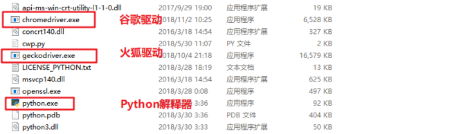

> Selenium采集数据

Selenium 是一个用于Web应用程序测试的工具。Selenium测试直接运行在浏览器中，就像真正的用户在操作一样。支持的浏览器包括IE（7, 8, 9, 10, 11），[Mozilla Chrome](https://baike.baidu.com/item/Mozilla Chrome/3504923)，Safari，Google Chrome，Opera等。

# 1. 动态网页&静态网页

静态网页是指存放在服务器文件系统中实实在在的HTML文件。当用户在浏览器中输入页面的URL，然后回车，浏览器就会将对应的HTML文件下载、渲染并呈现在窗口中。早期的网站通常都是由静态页面制作的。

## 1.1 动态网页

动态网页是相对于静态网页而言的。当浏览器请求服务器的某个页面时，服务器根据当前时间、环境参数、数据库操作等动态的生成HTML页面，然后在发送给浏览器（后面的处理就跟静态网页一样了）。

很明显，动态网页中的“动态”是指服务器端页面的动态生成，相反，“静态”则指页面是实实在在的、独立的文件。

**注意：** 

动态页面技术是与 [静态页面](https://baike.baidu.com/item/%E9%9D%99%E6%80%81%E9%A1%B5%E9%9D%A2) 技术相对应的，也就是说，网页URL的后缀不是 .htm、.html、.shtml、.xml 等静态网页的常见形式，而是以 .asp、.jsp、.php、.perl、.cgi 等形式为后缀，并且在 [**动态网页**](https://baike.baidu.com/item/%E5%8A%A8%E6%80%81%E7%BD%91%E9%A1%B5)  网址中有一个标志性的符号——“？”。

这里说的 [动态网页](https://baike.baidu.com/item/%E5%8A%A8%E6%80%81%E7%BD%91%E9%A1%B5) ，与网页上的各种动画、滚动字幕等视觉上的“动态效果”没有直接关系，动态网页也可以是纯文字内容的，也可以是包含各种动画的内容，这些只是网页具体内容的表现形式，无论网页是否具有动态效果，采用动态网站技术生成的网页都称为动态网页。

### 1.1.1 JavaScript

JavaScript是一种属于网络的脚本语言，已经被广泛用于Web应用开发，常用来为网页添加各式各样的动态功能，为用户提供更流畅美观的浏览效果。通常JavaScript脚本是通过嵌入在HTML中来实现自身的功能的。

可以在网页源代码的<scripy>标签里看到，比如：

```html
<script type="text/javascript" src="https://statics.huxiu.com/w/mini/static_2015/js/sea.js?v=201601150944"></script>
```

JavaScript可以动态地创建HTML内容，这些内容只有在JavaScript代码执行之后才会产生和显示如果使用传统的方法采集页面内容，就只能获得JavaScript代码执行之前页面上的内容。

**JQuery** 

JQuery是一个快速、简洁的JavaScript框架，它封装JavaScript常用的功能代码，提供一种简便的JavaScript设计模式，优化HTML文档操作、事件处理、动画设计和Ajax交互。一个网站使用 JQuery 的特征， 就是源代码里包含了 JQuery 入口，比如:

```html
<script type="text/javascript" src="https://statics.huxiu.com/w/mini/static_2015/js/jquery-1.11.1.min.js?v=201512181512"></script>
```

如果一个网站网页源码中出现了 jQuery，那么采集这个网站数据的时候要格外小心。因为jQuery可以动态地创建HTML内容，这些内容只有在JavaScript代码执行之后才会产生和显示。如果使用传统的方法采集页面内容，就只能获得JavaScript代码执行之前页面上的内容。

### 1.1.2 Ajax

使用Ajax技术更新网页的内容的网站有个很大的特点，那就是可以**在不重新加载整个网页的情况下，对网页的某部分进行更新。**

Ajax其实并不是一门语言，而是用来完成网络任务(可以认为它与网络数据采集差不多)的一系列技术。Ajax网站不需要使用整个的页面加载就可以和网络服务器进行交互。

### 1.1.3 DHTML

DHTML: Dynamic HTML 动态的HTML， 这门技术并不是一门新的技术， 而是将之前所学的HTML、CSS、JavaScript整合在一起，利用JS操作页面元素， 让元素具有动态的变化， 使得页面和用户具有交互的行为。

## 1.2 动态网页处理方法

使用动态加载的网站，用 Python 解决有如下几种途径:

1. 直接破解 `JavaScript` 代码里采集内容。
2. 抓包分析，查看截图的请求响应信息，伪造请求，实现响应的获取。(推荐)
3. 用 Python 的 第三方库运行 JavaScript，直接采集你在浏览器里看到的页面。(推荐)

**既然浏览器能拿到数据，那么，可以模拟一个浏览器，从浏览器中拿到数据。也就是用程序控制浏览器，从而达到数据采集的目的。** 

# 2. Selenium

Selenium 是一个 Web 的自动化测试工具，最初是为网站自动化测试而开发的，就像玩游戏用的按键精灵，可以按指定的命令自动操作。

Selenium 测试工具直接操控浏览器中，就像真正的用户在操作一样。Selenium 可以根据的指令，让浏览器自动加载页面，获取需要的数据，甚至页面截屏，或者判断网站上某些动作是否发生等。

## 2.1 Selenium工作原理


如图所示，通过 Python 来控制 Selenium，然后让 Selenium 控制浏览器，操纵浏览器，这样就实现了使用Python 间接的操控浏览器。

### 2.1.1 Selenium配置

Selenium 支持多种浏览器，最常见的就是 **火狐** 和 **谷歌** 浏览器。首先在电脑上下载浏览器，浏览器版本不宜过新。

**本教材使用版本：**

**火狐：截图如下**


**谷歌：截图如下**


### 2.1.2 浏览器驱动

Selenium具体怎么就能操纵浏览器呢？这要归功于 **浏览器驱动** ，Selenium可以通过API接口实现和浏览器驱动的交互，进而实现和浏览器的交互。所以要配置浏览器驱动。

**本教材使用版本：**

**火狐驱动：geckodriver 0.23.0 ( 2018-10-04)**

**火狐驱动下载地址：** http://npm.taobao.org/mirrors/geckodriver/

**谷歌驱动：ChromeDriver 71.0.3578.33**

**谷歌驱动下载地址：**

https://npm.taobao.org/mirrors/chromedriver/

http://chromedriver.storage.googleapis.com/index.html

**配置浏览器驱动：**

将下载好的浏览器驱动解压，将解压出的 `exe` 文件放到Python的安装目录下，也就是和`python.exe`同目录即可。



### 2.1.3 使用Selenium

**安装Selenium**

```
pip install selenium
```

**本教材使用版本号**：**Selenium == 3.141.0**

## 2.2 快速入门

```python
'''
	打开百度首页
'''
from selenium import webdriver

driver = webdriver.Chrome()
url = 'https://www.baidu.com/'
driver.get(url)
# 打开 get 就类似与在浏览器地址栏里面放入网址
driver.get(url)
# 退出浏览器
driver.quit()
```

## 2.3 元素的提取

Selenium 提供了丰富的元素提取的方式。可以直接在返回的响应中提取数据即可。Selenium 提供了8种方式来提取元素。

### 2.3.1 css选择器

##### find_element_by_css_selector()

```python
'''
数据的提取:
    Selenium提供了8种方式来提取元素.
    find_element_by_css_selector()  通过css选择器找到元素
    调用:
        driver 是 实例化后的对象
        driver.find_element_by_css_selector()
'''
# 清空 input 标签
driver.find_element_by_css_selector('#kw').clear()
# 点击搜索关键字
driver.find_element_by_css_selector('#kw').send_keys('python')
# 点击搜索按钮
driver.find_element_by_css_selector('#su').click()
```

### 2.3.2 XPATH

##### find_element_by_xpath()

```python
# 清空 input 标签
driver.find_element_by_xpath('//*[@id="kw"]').clear()
# 点击搜索关键字
driver.find_element_by_xpath('//*[@id="kw"]').send_keys('你好')
# 点击搜索按钮
driver.find_element_by_xpath('//*[@id="su"]').click()
```

**注意：**

- `find_element_**()` 类型的方法只能获取元素。想要获取属性要使用`get_attribute()`方法

  ```
  driver.find_element_by_xpath('//*[@id="kw"]').get_property('name')
  driver.find_element_by_xpath('//*[@id="kw"]').get_attribute('class')
  ```

- `find_element_**()` 类型的方法只能获取一个元素。想要获取多个元素，可以采用`find_elements_**()`，中间多了一个s，代表获取多个。

### 2.3.3 其他方式

##### find_element_by_link_text()

通过文本链接来定位元素

##### find_element_by_partial_link_text()

通过文字链接中的一部分文字定位，属于**模糊定位**：

```
driver.find_element_by_link_text('把百度设为主页').get_attribute('id')
driver.find_element_by_partial_link_text('把百度').get_attribute('id')
```

##### 其他方式 

find_element_by_id()

find_element_by_class_name()

根据类名定位元素

find_element_by_tag_name()

根据标签名定位元素

find_element_by_name()

根据元素名定位元素

# 3. 渲染

## 3.1 页面等待

现在的网页越来越多采用了 Ajax 技术，这样程序便不能确定何时某个元素完全加载出来了。如果实际页面等待时间过短导致某个dom元素还没出来，但是你的代码直接使用了这个WebElement，那么就会抛出ElementNotVisibleException的异常。

为了避免这种元素定位困难而且会提高产生 ElementNotVisibleException 的概率。所以 Selenium 提供了两种等待方式：

- 一种是隐式等待
- 一种是显式等待

### 3.1.1 隐式等待

隐式等待比较简单，就是简单地设置一个等待时间，单位为秒。隐式等待是等页面加载完毕，而不是元素加载！！！（隐式等待就是针对页面的，显式等待是针对元素的。）

```python
"""
    https://www.wjx.cn/jq/53732451.aspx
"""
from selenium import webdriver

url = 'https://www.receivesmsonline.net/'

driver = webdriver.Chrome()

# 等待
driver.implicitly_wait(10)
# 对这个没有限制
driver.get(url)

# 肯定出错 程序一致在这个地方等待 10 秒  一致等到你找到 或者 等到规定的时间 在规定的时间没找到 就报错
driver.find_element_by_xpath('adasdafgaghs')

```

隐式等待只需设置一次，后面的都遵循这个规则，不像`time.sleep`。`time.sleep`属于强制等待。

### 3.1.2 显式等待

显式等待指定某个条件，然后设置最长等待时间。如果在这个时间还没有找到元素，还没有满足某个条件，那么便会抛出异常了。显式等待是等元素加载！！！

```python
'''
显式等待指定某个条件，然后设置最长等待时间

WebDriverWait:
    WebDriverWait(driver， timeout) 实例化的driver  timeout等待的时间


until:
    直到xx条件符合为止
    until(条件)

条件:
    presence_of_element_located: 当前的元素被加载进来了
    presence_of_element_located是一个类 初始化要写定位的元素  一般是元组格式: (By.ID， 'vaule')

'''
import time
# 导入模块
from selenium import webdriver
# 导入等待的显式等待的类
from selenium.webdriver.support.ui import WebDriverWait  # WebDriverWait(driver)
# 导入判断元素的条件
from selenium.webdriver.support import expected_conditions as EC
# 导入选择元素的方法
from selenium.webdriver.common.by import By


url = 'https://www.receivesmsonline.net/'

driver = webdriver.Chrome()

driver.get(url)

try:
    startTime = time.time() # 计算时间戳
    print('开始进入等待时间---->>'， startTime)

    wait = WebDriverWait(driver， 5)
    # 一直去寻找(By.ID， 'asdhakhkfl')被加载进来 直到时间耗尽  如果提前找到 就提前返回
    element = wait.until(EC.presence_of_element_located((By.ID， 'asdhakhkfl')))

except:
    endTime = time.time()
    print('等待了多少秒---->>'， endTime - startTime)
```

下面是一些内置的等待条件，可以直接调用，而不用自己写这些等待条件：

- `title_is`： 判断当前页面的title是否完全等于（==）预期字符串，返回布尔值
- `title_contains` : 判断当前页面的title是否包含预期字符串，返回布尔值
- `presence_of_element_located` : 判断某个元素是否被加到了`dom`树里，并不代表该元素一定可见
- `visibility_of_element_located` : 判断某个元素是否可见. 可见代表元素非隐藏，并且元素的宽和高都不等于0
- `visibility_of` : 跟上面的方法做一样的事情，只是上面的方法要传入`locator`，这个方法直接传定位到的element就好了
- `presence_of_all_elements_located` : 判断是否至少有1个元素存在于`dom`树中。举个例子，如果页面上有n个元素的class都是`column-md-3`，那么只要有1个元素存在，这个方法就返回True
- `text_to_be_present_in_element` : 判断某个元素中的text是否 包含 了预期的字符串
- `text_to_be_present_in_element_value` : 判断某个元素中的value属性是否 包含 了预期的字符串
- `frame_to_be_available_and_switch_to_it` : 判断该`frame`是否可以`switch`进去，如果可以的话，返回`True`并且`switch`进去，否则返回`False`
- `invisibility_of_element_located` : 判断某个元素中是否不存在于`dom`树或不可见
- `element_to_be_clickable` : 判断某个元素中是否可见并且是`enable`的，这样的话才叫`clickable`
- `staleness_of` : 等某个元素从`dom`树中移除，注意，这个方法也是返回True或False
- `element_to_be_selected` : 判断某个元素是否被选中了，一般用在下拉列表
- `element_selection_state_to_be` : 判断某个元素的选中状态是否符合预期
- `element_located_selection_state_to_be` : 跟上面的方法作用一样，只是上面的方法传入定位到的`element`，而这个方法传入`locator`
- `alert_is_present` : 判断页面上是否存在`alert`

## 3.2 执行JS代码

**执行下拉滚动条**

```python
'''
执行下拉滚动条:
    往往用于点击事件  下拉以后才能点击的
'''


'''
下拉网易云音乐:
    注意切入框内
'''
from selenium import webdriver

url = 'https://music.163.com/#/song?id=254574'

driver = webdriver.Chrome()

driver.get(url)

# 切入框内
driver.switch_to.frame(0)

# 执行js代码 下拉滚动条
js = 'window.scrollBy(0， 8000)'
# 执行js
driver.execute_script(js)

'''
注意:
    对于含有iframe的框也需要先切换进入框内才可以下拉。
'''
```


**先找到（滑动到看得到的位置）标签再去点击**

    driver.execute_script("arguments[0].scrollIntoView();", 标签)


# 4. 页面操作

Selenium 的 WebDriver 提供了各种方法来寻找元素，在找到这些元素以后，可以进行鼠标式的操作，比如点击，拖动，滑动，双击，甚至输入文本等。通过灵活的API可以实现灵活的页面操作。灵活的页面操作正是爬虫所需要的，在抓取的过程中难免会遇到翻页，点击下一页，点击登录等。所以学习这些可以帮更好的完成数据采集工作。

## 4.1 点击 & 输入文本动作

单击 `.click()` 可以模拟鼠标点击事件。输入文字 .send_keys() 可以模拟键盘输入文字。

```python
# -*- coding: utf-8 -*-
"""
点击 & 输入文本动作:
"""
from selenium import webdriver

driver = webdriver.Chrome()
url = 'https://www.baidu.com/'
driver.get(url)
# 定位框所在的位置(元素)
search_element = driver.find_element_by_css_selector('#kw')
# 清空标题框内容
search_element.clear()
# 往元素中中传入值 .send_keys('值')
search_element.send_keys('美女')
# 定位点击搜索
click_element = driver.find_element_by_id('su')
# 点击一下
click_element.click()
input()
driver.quit()

```

### 4.1.1 选择下拉框

已经知道了怎样向文本框中输入文字，但是有时候会碰到 <select> </select> 标签的下拉框。直接点击下拉框中的选项不一定可行。Selenium专门提供了Select类来处理下拉框。 其实 WebDriver 中提供了一个叫 Select 的方法，可以帮助完成这些事情：http://www.jq22.com/demo/shengshiliandong/

```python
'''
下拉框:
    Select(element) element是下拉框的元素
    选择的方法:
        1. select_by_value(value)  value="天津市"
        2. select_by_index(1)  通过索引 1 2 3 4 5 6
        3. select_by_visible_text(text) 通过可见的文本
'''
import time
from selenium import webdriver
from selenium.webdriver.support.select import Select

url = 'http://www.jq22.com/demo/shengshiliandong/'

# 初始化浏览器
driver = webdriver.Chrome()
# 打开
driver.get(url)

# 寻找可以选择的元素 并实例化Select

elememt = driver.find_element_by_xpath('//*[@id="s_province"]')

# 实例化Select
select = Select(elememt)
time.sleep(2)
# 选择具体的值
select.select_by_index(5)
time.sleep(2)
select.select_by_value('河南省')
time.sleep(2)
select.select_by_visible_text('四川省')
# %%
driver.quit()

```

以上是三种选择下拉框的方式，它可以根据索引来选择，可以根据值来选择，可以根据文字来选择。注意：

- index 索引从 0 开始
- value是option标签的一个属性值，并不是显示在下拉框中的值
- visible_text是在option标签文本的值，是显示在下拉框的值

### 4.1.3 鼠标动作链

有些时候，需要在页面上模拟一些鼠标操作，比如双击、右击、拖拽甚至按住不动等，可以通过导入 ActionChains 类来做到：http://www.runoob.com/try/try.php?filename=jqueryui-api-droppable  比如：	

```python
'''
拖动鼠标:
    ActionChains:
        ActionChains() --> 直接传入driver --> ActionChains(driver) 实例化
        perform --> 执行动作
        drag_and_drop(source， target)  source拖动的元素  target元素被放置的位置

'''
import time
from selenium import webdriver
from selenium.webdriver import ActionChains


# 网址
url = 'http://www.runoob.com/try/try.php?filename=jqueryui-api-droppable'

# 初始化
driver = webdriver.Chrome()
# 打开网站
driver.get(url)

# 切入框内
driver.switch_to.frame(0)

# 找到可以拖拽的元素
drag = driver.find_element_by_css_selector('#draggable')
# 需要放置的位置的元素
drop = driver.find_element_by_css_selector('#droppable')

# 实例化
action = ActionChains(driver)
# 定义动作 但是不执行 没有执行
action.drag_and_drop(drag， drop)
# 执行
action.perform()

time.sleep(5)

driver.quit()

'''
注意:
    perform才是真正的执行  可以在perform之前定义多个动作 最后一起执行
    注意切入框内 switch_to.frame(0)
'''
```

### 4.1.4 其他 (了解)

- 弹窗处理

当你触发了某个事件之后，页面出现了弹窗提示，处理这个提示或者获取提示信息方法如下：`driver.switch_to_alert()`

- 窗口切换

一个浏览器肯定会有很多窗口，所以我们肯定要有方法来实现窗口的切换。切换窗口的方法如下：`switch_to.window("this is window name")`

- 页面前进和后退

操作页面的前进和后退功能：前进：`driver.forward()` 后退：`driver.back()`

- Cookie

获取页面每个Cookie值：`driver.get_cookies()`

## 模拟登陆github

```python
"""
模拟登陆 github
"""
from selenium import webdriver

driver = webdriver.Chrome()
url = 'https://github.com/'
driver.get(url)
# 窗口最大化
driver.maximize_window()

# %%
# 点击登录按钮
login_element = driver.find_element_by_css_selector('a.HeaderMenu-link.no-underline.mr-3')
login_element.click()
# %%
# 定位账号输入框
username_field = driver.find_element_by_css_selector('#login_field')
# 输入账号
username_field.send_keys('paisenpython')
# 定位密码框
password_field = driver.find_element_by_css_selector('#password')
# 输入密码
password_field.send_keys('paisen123/*-')
# 定位发送按钮
submit_field = driver.find_element_by_css_selector('input.btn.btn-primary.btn-block')
# 点击提交按钮
submit_field.click()

# %%
driver.quit()

```


## 网易云音乐评论采集

应用上面的技巧，让我们看一看怎么实现网易云音乐评论的采集。

```python
'''
重构:
    采用面向对象
'''
import time
from selenium import webdriver

class YunSpider(object):

    def __init__(self， url):
        # 网址
        self.url = url
        # 初始化浏览器
        self.driver = webdriver.Chrome()

    def getContent(self):

        # 打开网址
        self.driver.get(self.url)
        # 切入框内
        self.driver.switch_to.frame(0)

        for n in range(5):
            # 下拉混动条
            js = 'window.scrollBy(0， 8000)'
            self.driver.execute_script(js)

            time.sleep(1)

            # 选元素
            elememts = self.driver.find_elements_by_xpath('//div[contains(@class，"cmmts")]/div')
            # 循环遍历
            for text in elememts:
                result = text.find_element_by_xpath('.//div[contains(@class，"cnt f-brk")]').text
                print(result)

            # 翻页
            self.driver.find_element_by_partial_link_text('下一').click()
            time.sleep(1)  # 暂停1s

    @staticmethod
    def save2File(data):
        with open('Yun.txt'， 'a'， encoding='utf-8') as fp:
            fp.write(data+'\n') # print

    # 在对象销毁的时候自动执行这个魔术方法 引用计数为0
    def __del__(self):
        # 退出
        self.driver.quit()

if __name__ == '__main__':

    url = 'https://music.163.com/#/song?id=574566207'

    yunspider = YunSpider(url)
    yunspider.getContent()
```

## 爬虫，反爬虫，反反爬虫(了解)

### 第一天

- 小源看到某网站的电影不错，想要该网站上所有的电影，写了一个简单的爬虫(基于requests库)，使用循环，不断地遍历该网站的电影列表页面，根据 Html 分析电影名字，资源链接等存进自己的**数据库**。
- 这个站点的运维小码打开电脑日志发现某个时间段请求量陡增，以为自己网站要“火”，分析日志发现都是 IP(xxx.xxx.xxx.xxx)这个用户，并且 **User-Agent** 还是 python-requests/2.18.4 ，基于这两点判断非人类后直接在服务器上封杀，永久封禁该IP地址。

### 第二天

- 小源早上起来后发现自己的小爬虫不能得到数据了，返回的都是错误提示。而且在浏览器中页发现这个电影网站不能打开了，于是想到了，该网站对自己实行了封禁。于是也针对性的变换了下策略：

1. ser-Agent 模仿百度("**Baiduspider**...") --> 或者随机替换请求头（使用fake_useragent模块）
2. IP每爬半个小时就换一个IP代理。

- 小码也发现了对应的变化，于是在服务器上设置了一个频率限制，每分钟超过120次请求的再屏蔽IP。 同时考虑到百度家的爬虫有可能会被误伤，想想市场部门每月几十万的投放，于是写了个脚本，通过 hostname 检查下这个 ip 是不是真的百度家的，对这些 IP 设置一个白名单。

### 第三天

- 小源发现了新的限制后，想着我也不急着要这些数据，留给服务器慢慢爬吧，于是修改了代码，随机1-3秒爬一次（time.sleep， random模块），爬10次休息10秒，每天只在8-12，18-20点爬，隔几天还休息一下。
- 小码看着新的日志头都大了，再设定规则不小心会误伤(率)真实用户，于是准备换了一个思路，当3个小时的总请求超过50次的时候弹出一个验证码弹框，没有准确正确输入的话就把 IP 记录进黑名单。

### 第四天

- 小源看到验证码有些傻脸了，不过也不是没有办法，先去学习了图像识别（关键词 PIL,tesseract），再对验证码进行了二值化，分词，模式训练之后，总之最后识别了小码的验证码（关于验证码，验证码的识别，验证码的反识别也是一个恢弘壮丽的斗争史...），之后爬虫又跑了起来。
- 小码是个不折不挠的好同学，看到验证码被攻破后，和开发同学商量了变化下开发模式，数据并不再直接渲染，而是由前端同学异步获取，并且通过 JavaScript 的加密库生成动态的 token，同时加密库再进行混淆（比较重要的步骤的确有网站这样做，参见淘宝和微博的登陆流程）。

### 第五天

- 混淆过的加密库就没有办法了么？当然不是，可以慢他放弃了基于 HttpClient的爬虫慢调试，找到加密原理，不过小源不准备用这么耗时耗力的方法，，选择了内置浏览器引擎的爬虫(关键词：PhantomJS,Selenium)，使用Python代码操控浏览器，在浏览器引擎运行页面，直接获取了正确的结果，又一次拿到了对方的数据。
- 小码：.....

