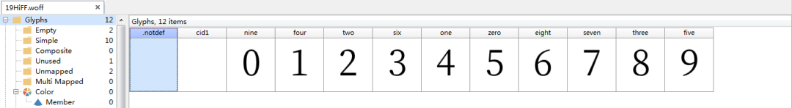
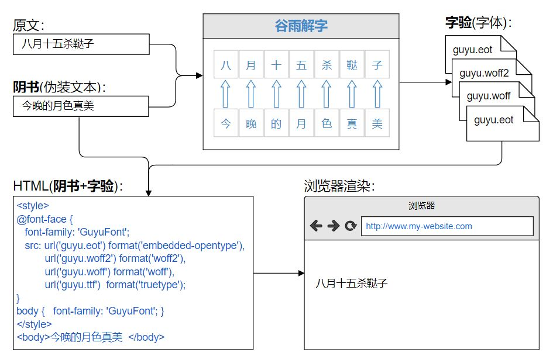
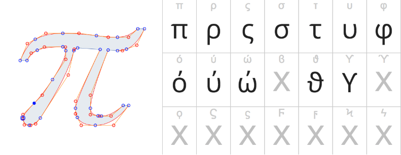

# 字体反扒

## 认识字体

在爬虫爬取页面的时候，页面中的代码是乱码，但是在人眼看到的是原文，这样的映射关系让爬虫无法顺利爬取到网站内容。



**1.文字的外在形式特征。**就是文字的风格，是文字的外衣。 字体的[艺术性](https://baike.baidu.com/item/%E8%89%BA%E6%9C%AF%E6%80%A7/1425228)体现在其[完美](https://baike.baidu.com/item/%E5%AE%8C%E7%BE%8E/30276)的外在形式与丰富的内涵之中。 字体是文化的载体，是[社会](https://baike.baidu.com/item/%E7%A4%BE%E4%BC%9A/73320)的缩影。

**2.微机系统的字体font。**这类字体是[电脑](https://baike.baidu.com/item/%E7%94%B5%E8%84%91/124859)必用字体，存在于“[fonts](https://baike.baidu.com/item/fonts/10842209)”[文件夹](https://baike.baidu.com/item/%E6%96%87%E4%BB%B6%E5%A4%B9/7031091)里。

 [字体-百度百科](<https://baike.baidu.com/item/%E5%AD%97%E4%BD%93/5167264?fr=aladdin>) 

一款字库的诞生，要经过字体设计师的创意设计、字体制作人员一笔一划的制作、修改，技术开发人员对字符进行编码、添加程序指令、装库、开发安装程序，测试人员对字库进行校对、软件测试、兼容性测试，生产部门对字库进行最终产品化和包装上市等几个环节。

蚂蚁字体：http://www.zitiweb.com/ziti/744


网页字体是一个字形集合，而每个字形是描述字母或符号的矢量形状。

很多网站的数据肉眼看着很像，但是是由一些特殊文件渲染出来的，即使得到了数据，但是读取出来会有文件。

在字体加密的网站中用户也是无法直接进行复制网页内容的。

因此，特定字体文件的大小由两个简单变量决定：每个字形矢量路径的复杂程度和特定字体中字形的数量。




网页字体是一个字形集合，而每个字形是描述字母或符号的矢量形状。 因此，特定字体文件的大小由两个简单变量决定：每个字形矢量路径的复杂程度和特定字体中字形的数量。




目前有使用字体加密的网站大概有下面这些：

58同城，起点，猫眼，大众点评，启信宝，天眼查，实习僧，汽车之家

既然这么多的网站都采用了字体加密，那么它一定是一个有效的反爬手段，作为爬虫工程师我们应该如何应对呢？

通俗一点，同一内容的网页字体每个字形应该都是大同小异的，我们可以通过比对字体文件的字形来确认映射的内容。

目前网络上使用的字体容器格式有四种： EOT、 TTF 和 WOFF2。但是各个浏览器对字体的支持程度不一致。

浏览器上使用网址通常是以 `@font-face` 引入使用类型

```css
@font-face {
  font-family:'Awesome Font';
  font-style: italic;
  font-weight: 400;
  src: local('Awesome Font Italic'),
       url('/fonts/awesome-i.woff2') format('woff2'),
       url('/fonts/awesome-i.woff') format('woff'),
       url('/fonts/awesome-i.ttf') format('truetype'),
       url('/fonts/awesome-i.eot') format('embedded-opentype');
}
```

首先，请注意以上示例使用两种样式（normal 和*italic*）来定义单个 *Awesome Font* 系列，其中的每个样式均指向一个不同的字体资源集。 每个 `src` 描述符则又包含一个用逗号分隔的资源变体优先级列表：

- `local()` 指令用于引用、加载和使用安装在本地的字体。
- `url()` 指令用于加载外部字体，它可以包含可选的 `format()` 提示，指示由提供的网址引用的字体格式。

注：除非您引用的是其中默认系统字体，如果使用的是自己定义的字体，就需要提供一个 `url()` 条目列表。

## 处理字体

如果想要把自定义的字体文字变化为系统能够识别的内容，就需要获取自定义字体与通用字体的映射规则，经过转化后就能得到正常文字信息。

字体解密的大致流程：

- 先找到字体文件的位置，查看源码大概就是xxx.tff这样的文件
- 重复上面那个操作，将两个字体文件保存下来
- 用上面的软件或者网址打开，并且通过 Python fontTools 将 tff 文件解析为 xml 文件
- 根据字体文件解析出来的 xml 文件与类似上面的字体界面找出相同内容的映射规律（重点）
- 在 Python 代码中把找出的规律实现出来，让你的代码能够通过这个规律还原源代码与展示内容的映射

## 案例：起点中文网

### 踩点

打开起点中文的，随便找一篇文章，点入详情页。选择文字数据内容，就可以观察到字体显示的是特殊的符号，这种就是被加密了，可以查看其在网页中是什么样的内容。


可以在源代码中，看到这些数据都是一些特殊的符号。其中映射规则如下

```
&#100432; --> 2
&#100425; --> 5
&#100425; --> 5
&#100423; --> .
&#100432; --> 2
&#100430; --> 8
```


### 下载字体

但由于字体映射规则不是固定的，所以需要我们继续找。查找加密内容的字体，就会发现每个被加密的字体都应用了同一个字体文件。


在 network 搜索之后，就可以发现这个字体的下载地址。然后就可以将字体文件给下载下来。


### 处理字体

字体下载好之后，可以用专门查看字体的工具查看里面的内容


而我们需要做的则是让Python代码自动识别字体，然后在代码中将加密数据替换就大功告成了。

在Python里面处理字体需要先安装

```
pip install fontTools
```

使用也比较简单

```python
# 把字体文件读取为python能理解的对象
from fontTools.ttLib import TTFont

# 字体文件名字
font_name = 'pbrRoZFn.woff'

base_font = TTFont(font_name)
# 将字体关系保存为 xml 格式
base_font.saveXML('font.xml')
# 获取映射规则
map_list = base_font.getBestCmap()
# 字符编码：字符内容
print(map_list)
```

### 替换字体

最后，将加密的字体，根据替换规则全部替换成正常的内容即可。

## 案例：大众点评

### 踩点

大众点评比较麻烦，因为其有多套字体文件与多套反扒规则。所以需要找到其的规律，让代码自动转化。简单分析之后就能直接招待字体文件所在位置


字体文件存在css样式表中。哪个等下请求的顺序应该是先请求html匹配出css文件地址，再请求css文件匹配出字体的正式地址，然后进行下载。


# 工具下载

字体内容查看工具

链接：https://pan.baidu.com/s/1Y8I3B0Hrr1DVfvDZiLX4EQ 
提取码：5wva